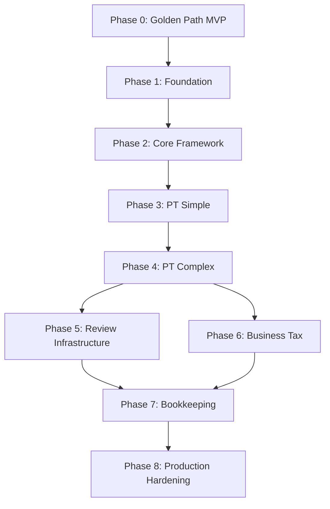
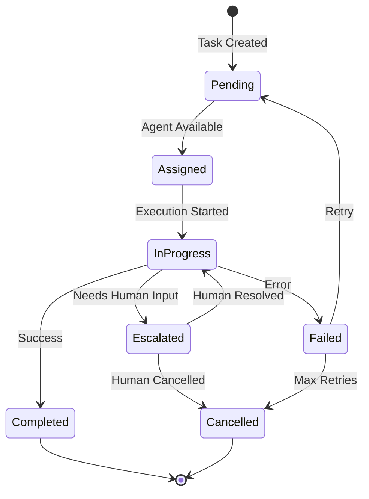
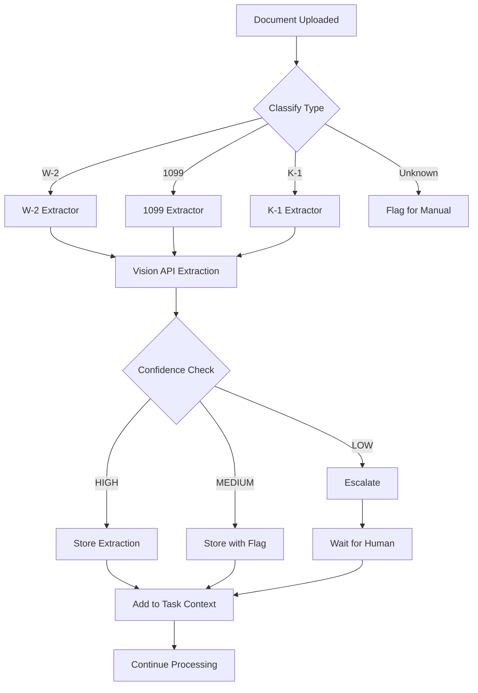
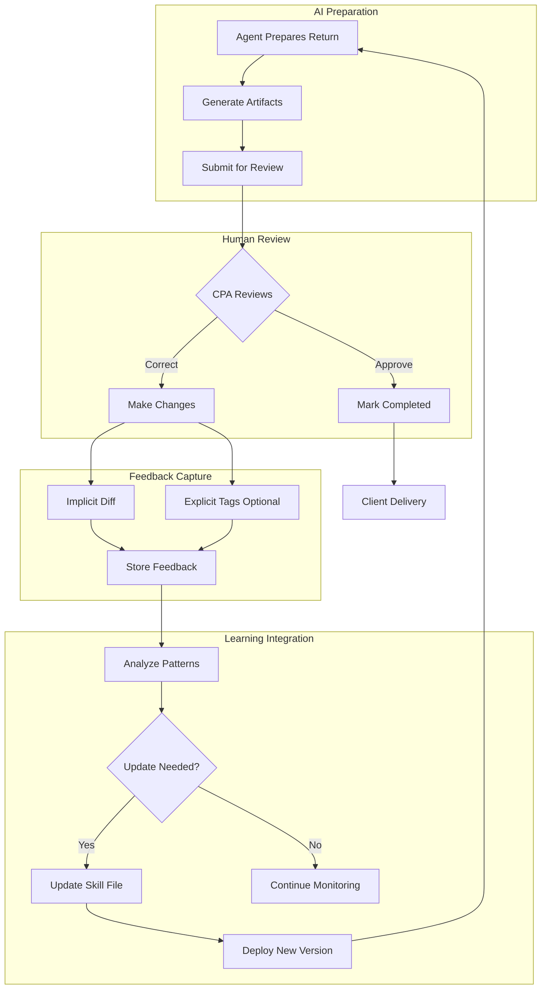
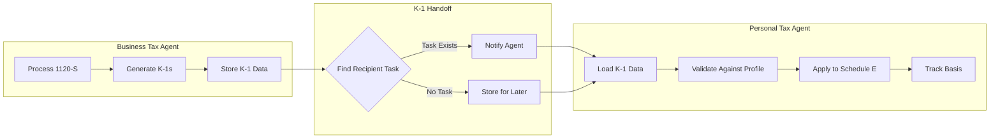

# Rookie: AI Employee Platform for CPA Firms

## Master Specification v1.0

---

## Executive Summary

Rookie is an AI employee platform for CPA firms that performs actual accounting work—tax return preparation, transaction categorization, and reconciliation—under human supervision. Unlike chatbots or narrow automation tools, Rookie operates as a full workflow participant: it reads source documents, understands client history, follows firm procedures, and produces professional work products ready for human review.

**Core Philosophy**: Treat AI exactly like a new employee. Mistakes are expected, feedback is provided, performance improves over time. The CPA remains professionally liable; Rookie prepares, humans sign.

**V1 Scope**: Single-firm deployment. Multi-tenancy deferred until core value is proven.

---

## Quick Start Guide

Get Rookie running and process your first tax return in 5 steps.

### Step 1: Clone and Setup

```bash
git clone https://github.com/yourfirm/rookie.git
cd rookie
cp .env.example .env
# Edit .env with your API keys (ANTHROPIC_API_KEY, etc.)
```

### Step 2: Start Infrastructure

```bash
docker-compose up -d postgres redis
uv venv && source .venv/bin/activate
uv pip install -r requirements.txt
python -m alembic upgrade head
```

### Step 3: Start the API Server

```bash
uvicorn src.main:app --reload --port 8000
# Verify: curl http://localhost:8000/api/health
# Expected: {"status": "ok", "db": "connected", "redis": "connected"}
```

### Step 4: Create Test Client and Upload Documents

```bash
# Create test client
curl -X POST http://localhost:8000/api/clients \
  -H "Content-Type: application/json" \
  -d '{"external_id": "TEST_001", "full_name": "Test Client"}'

# Upload test documents to: clients/TEST_001/2025/source_docs/
# Required: At least one W-2 PDF
```

### Step 5: Run Your First Task

```bash
# Create and run a 1040 prep task
curl -X POST http://localhost:8000/api/tasks \
  -H "Content-Type: application/json" \
  -d '{
    "client_id": "TEST_001",
    "task_type": "1040_prep",
    "tax_year": 2025
  }'

# Monitor progress
curl http://localhost:8000/api/status/tasks

# Expected output in clients/TEST_001/2025/workpapers/:
# - drake_worksheet_2025.xlsx
# - preparer_notes_2025.md
```

### Verification Checklist

- [ ] Health endpoint returns connected status
- [ ] Test client created successfully
- [ ] Documents visible in client folder
- [ ] Task completes with status "completed"
- [ ] Drake worksheet contains extracted W-2 data
- [ ] Preparer notes include summary section

---

## Part 1: System Architecture

### 1.1 High-Level Architecture

```
┌─────────────────────────────────────────────────────────────────────────────┐
│                              EXTERNAL SYSTEMS                                │
│  ┌──────────────┐    ┌──────────────┐    ┌──────────────┐    ┌───────────┐ │
│  │   TaxDome    │    │    Drake     │    │     QBO      │    │  GDrive/  │ │
│  │  (workflow)  │    │  (desktop)   │    │    (API)     │    │  Dropbox  │ │
│  └──────┬───────┘    └──────▲───────┘    └──────┬───────┘    └─────┬─────┘ │
└─────────┼───────────────────┼───────────────────┼──────────────────┼───────┘
          │ webhook/email     │ Excel upload      │ OAuth            │ API
          ▼                   │                   ▼                  ▼
┌─────────────────────────────┼───────────────────────────────────────────────┐
│                             │        ROOKIE PLATFORM                         │
│  ┌──────────────────────────┼───────────────────────────────────────────┐   │
│  │                    API GATEWAY (FastAPI)                              │   │
│  │  • Rate limiting (100 req/min/client)                                 │   │
│  │  • Authentication (JWT, 1hr expiry)                                   │   │
│  │  • Request validation (Pydantic)                                      │   │
│  └──────────────────────────┬───────────────────────────────────────────┘   │
│                              │                                               │
│  ┌───────────────────────────┼───────────────────────────────────────────┐  │
│  │                   ORCHESTRATION LAYER                                  │  │
│  │  ┌─────────────────┐    ┌─────────────────┐    ┌─────────────────┐   │  │
│  │  │  Task Dispatcher │    │  State Machine  │    │ Circuit Breaker │   │  │
│  │  │  (routes by type)│    │  (FSM per task) │    │ (5-fail/30s-off)│   │  │
│  │  └─────────────────┘    └─────────────────┘    └─────────────────┘   │  │
│  └───────────────────────────┬───────────────────────────────────────────┘  │
│                              │                                               │
│  ┌───────────────────────────┼───────────────────────────────────────────┐  │
│  │                      AGENT LAYER                                       │  │
│  │  ┌─────────────┐  ┌─────────────┐  ┌─────────────┐  ┌─────────────┐  │  │
│  │  │ PersonalTax │  │ BusinessTax │  │ Bookkeeping │  │   Checker   │  │  │
│  │  │   Agent     │  │   Agent     │  │   Agent     │  │   Agent     │  │  │
│  │  │ (max: 3)    │  │ (max: 2)    │  │ (max: 3)    │  │ (max: 2)    │  │  │
│  │  └─────────────┘  └─────────────┘  └─────────────┘  └─────────────┘  │  │
│  └───────────────────────────┬───────────────────────────────────────────┘  │
│                              │                                               │
│  ┌───────────────────────────┼───────────────────────────────────────────┐  │
│  │                    SHARED SERVICES                                     │  │
│  │  ┌─────────────┐  ┌─────────────┐  ┌─────────────┐  ┌─────────────┐  │  │
│  │  │  Document   │  │   Client    │  │    Skill    │  │  Feedback   │  │  │
│  │  │  Processor  │  │   Profile   │  │   Engine    │  │  Collector  │  │  │
│  │  │ (vision API)│  │  (append-   │  │ (versioned  │  │ (diff-based)│  │  │
│  │  │             │  │   only log) │  │  YAML)      │  │             │  │  │
│  │  └─────────────┘  └─────────────┘  └─────────────┘  └─────────────┘  │  │
│  └───────────────────────────┬───────────────────────────────────────────┘  │
│                              │                                               │
│  ┌───────────────────────────┼───────────────────────────────────────────┐  │
│  │                      DATA LAYER                                        │  │
│  │  ┌─────────────────────┐    ┌─────────────────────┐                   │  │
│  │  │     PostgreSQL      │    │       Redis         │                   │  │
│  │  │  • tasks            │    │  • job queue        │                   │  │
│  │  │  • task_logs        │    │  • real-time status │                   │  │
│  │  │  • client_profiles  │    │  • circuit breaker  │                   │  │
│  │  │  • documents        │    │  • rate limiting    │                   │  │
│  │  │  • feedback         │    │                     │                   │  │
│  │  │  • pgvector (RAG)   │    │                     │                   │  │
│  │  └─────────────────────┘    └─────────────────────┘                   │  │
│  └───────────────────────────────────────────────────────────────────────┘  │
│                                                                              │
│  ┌───────────────────────────────────────────────────────────────────────┐  │
│  │                    OBSERVABILITY (from Day 1)                          │  │
│  │  • Structured JSON logging (task_id, client_id, agent, duration)      │  │
│  │  • Prometheus metrics (task_count, error_rate, llm_latency)           │  │
│  │  • Error tracking (Sentry or equivalent)                              │  │
│  └───────────────────────────────────────────────────────────────────────┘  │
└──────────────────────────────────────────────────────────────────────────────┘
```

### 1.2 Technology Stack

| Component | Technology | Rationale |
|-----------|------------|-----------|
| **Language** | Python 3.11+ | Best AI/ML ecosystem, mature agent frameworks |
| **API Framework** | FastAPI | Async support, automatic OpenAPI docs, type validation |
| **Database** | PostgreSQL 15+ | Robust, supports JSON, extensible |
| **Vector Store** | pgvector | Integrated with PostgreSQL, no separate service |
| **Cache/Queue** | Redis | Real-time status, pub/sub for events, job queue |
| **LLM Provider** | Claude (primary) | Best reasoning, vision capability |
| **Document Processing** | LLM Vision APIs | Extract data from PDFs, images |
| **File Storage** | Google Drive / Dropbox API | Client document access |

### 1.3 Deployment Model

- **Single-firm deployment** for v1 (multi-tenancy deferred)
- Horizontal scaling via agent instance replication
- Stateless API layer, state persisted in PostgreSQL/Redis
- Background task processing via async workers

---

## Part 2: Multi-Agent System Design

### 2.1 Agent Hierarchy

```
┌───────────────────────────────────────────────────────────────┐
│                      AGENT HIERARCHY                           │
├───────────────────────────────────────────────────────────────┤
│                                                                │
│  ORCHESTRATOR (coordinates work, routes tasks)                │
│       │                                                        │
│       ├── PERSONAL TAX AGENT                                  │
│       │       ├── 1040 Preparer                               │
│       │       ├── Schedule A/B/C/D/E Handler                  │
│       │       └── Prior Year Comparator                       │
│       │                                                        │
│       ├── BUSINESS TAX AGENT                                  │
│       │       ├── 1120 Corporate Preparer                     │
│       │       ├── 1120-S S-Corp Preparer                      │
│       │       ├── 1065 Partnership Preparer                   │
│       │       └── K-1 Generator                               │
│       │                                                        │
│       ├── BOOKKEEPING AGENT                                   │
│       │       ├── Transaction Categorizer                     │
│       │       ├── Reconciliation Engine                       │
│       │       └── Month-End Processor                         │
│       │                                                        │
│       ├── CHECKER AGENT (verification, not approval)          │
│       │       ├── Source Document Validator                   │
│       │       ├── Prior Year Variance Analyzer                │
│       │       └── Completeness Checker                        │
│                                                                │
└───────────────────────────────────────────────────────────────┘
```

### 2.2 Agent Responsibilities

#### Personal Tax Agent (Build First)

- Load client profile and prior year return (PDF)
- Scan client folder for current year documents
- Extract data from W-2s, 1099s, K-1s using vision
- Execute 1040 preparation checklist
- Produce Drake worksheet (Excel format)
- Generate preparer notes with confidence levels
- Compare to prior year, flag significant changes

#### Business Tax Agent

- Handle 1120, 1120-S, 1065 returns
- Generate K-1 schedules for partners/shareholders
- Track basis across years
- Integrate with bookkeeping data

#### Bookkeeping Agent

- Categorize QuickBooks transactions
- Reconcile bank accounts
- Process month-end checklists
- Generate variance reports

#### Checker Agent

- Verify numbers against source documents
- Analyze variances from prior year
- Flag items without documented reasons
- **Cannot approve** — human is always final gate

### 2.5 K-1 Handoff Protocol

When Business Tax Agent generates K-1s, they must flow to Personal Tax Agent for shareholder/partner returns.

**Data Passed from Business Tax to Personal Tax:**

```yaml
k1_handoff:
  entity:
    name: "ABC Holdings LLC"
    ein: "XX-XXXXXXX"
    entity_type: "1120-S"
    tax_year: 2025
  
  recipient:
    name: "John Smith"
    ssn_last4: "1234"
    ownership_pct: 50.0
    
  income_items:
    ordinary_income: 45000.00
    guaranteed_payments: 0.00
    interest_income: 1200.00
    dividend_income: 800.00
    capital_gain_short: 0.00
    capital_gain_long: 2500.00
    section_1231_gain: 0.00
    
  deduction_items:
    section_179: 5000.00
    charitable_contributions: 1000.00
    
  credit_items:
    foreign_tax_credit: 0.00
    
  basis_tracking:
    beginning_basis: 125000.00
    contributions: 10000.00
    distributions: 20000.00
    share_of_income: 45000.00
    share_of_loss: 0.00
    ending_basis: 160000.00
    at_risk_amount: 160000.00
    
  flags:
    - "Distributions exceeded basis - taxable"
    - "Passive activity - material participation unclear"
```

**Handoff Trigger:**

```python
async def on_k1_generated(k1_data: K1Data) -> None:
    """Called when Business Tax Agent generates a K-1."""
    
    # 1. Store K-1 in database
    await db.save_k1(k1_data)
    
    # 2. Find recipient's personal tax task (if exists)
    personal_task = await db.find_task(
        client_ssn_last4=k1_data.recipient.ssn_last4,
        task_type="1040_prep",
        tax_year=k1_data.entity.tax_year
    )
    
    # 3. If task exists and in progress, notify agent
    if personal_task and personal_task.status == "in_progress":
        await notify_agent(
            agent_type="personal_tax",
            task_id=personal_task.id,
            event="k1_available",
            data=k1_data
        )
    
    # 4. Log handoff for audit
    await log_handoff(
        source_agent="business_tax",
        target_agent="personal_tax",
        k1_id=k1_data.id,
        status="pending_pickup"
    )
```

**Validation Steps:**

| Check | Source | Target | Action if Failed |
|-------|--------|--------|------------------|
| SSN matches | K-1 recipient | Client profile | Escalate - possible data error |
| Entity known | K-1 entity | Client profile income_sources | Add to profile, flag for review |
| Basis reconciles | Prior year K-1 | Current K-1 beginning_basis | Flag variance, continue |
| At-risk limitation | K-1 loss amounts | Basis tracking | Apply limitation, document |

### 2.3 Task Routing

**Flow:**
1. CPA assigns task in TaxDome to "Rookie" employee
2. Rookie receives notification (API or email trigger)
3. Orchestrator routes to appropriate agent based on task type
4. Agent executes, produces artifacts
5. Task status updates in TaxDome
6. Human reviews, provides feedback

### 2.4 Error Recovery Philosophy

| Scenario | Handling |
|----------|----------|
| Agent crashes mid-task | **Start over from beginning** (no partial state) |
| Ambiguous situation | Escalate to human, wait for instructions |
| Human redirects mid-task | Confirm cancel, then follow new direction |
| API failure | Retry with exponential backoff, then escalate |

---

## Part 3: Data Architecture

### 3.1 Core Database Schema

```sql
-- Clients (append-only log pattern for history)
CREATE TABLE clients (
    id UUID PRIMARY KEY DEFAULT gen_random_uuid(),
    external_id VARCHAR(50) NOT NULL,
    created_at TIMESTAMP DEFAULT NOW(),
    updated_at TIMESTAMP DEFAULT NOW()
);

-- Client profile entries (append-only log)
CREATE TABLE client_profile_entries (
    id UUID PRIMARY KEY DEFAULT gen_random_uuid(),
    client_id UUID REFERENCES clients(id),
    entry_timestamp TIMESTAMP DEFAULT NOW(),
    author_type VARCHAR(10) NOT NULL, -- 'human' or 'ai'
    author_id VARCHAR(100),
    entry_type VARCHAR(50) NOT NULL,
    content JSONB NOT NULL,
    tax_year INTEGER,
    created_at TIMESTAMP DEFAULT NOW()
);
CREATE INDEX idx_profile_client_time ON client_profile_entries(client_id, entry_timestamp DESC);

-- Tasks assigned to agents
CREATE TABLE tasks (
    id UUID PRIMARY KEY DEFAULT gen_random_uuid(),
    external_id VARCHAR(100), -- TaxDome task ID
    client_id UUID REFERENCES clients(id),
    task_type VARCHAR(50) NOT NULL,
    agent_type VARCHAR(50) NOT NULL,
    status VARCHAR(20) DEFAULT 'pending',
    attempt_count INTEGER DEFAULT 0,
    assigned_at TIMESTAMP,
    started_at TIMESTAMP,
    completed_at TIMESTAMP,
    error_message TEXT,
    created_at TIMESTAMP DEFAULT NOW()
);
CREATE INDEX idx_tasks_status ON tasks(status, agent_type);

-- Task artifacts (work products)
CREATE TABLE task_artifacts (
    id UUID PRIMARY KEY DEFAULT gen_random_uuid(),
    task_id UUID REFERENCES tasks(id),
    artifact_type VARCHAR(50) NOT NULL,
    file_path TEXT,
    content JSONB,
    version INTEGER DEFAULT 1,
    created_at TIMESTAMP DEFAULT NOW()
);

-- Escalations awaiting human response
CREATE TABLE escalations (
    id UUID PRIMARY KEY DEFAULT gen_random_uuid(),
    task_id UUID REFERENCES tasks(id),
    question TEXT NOT NULL,
    context TEXT,
    blocking BOOLEAN DEFAULT true,
    status VARCHAR(20) DEFAULT 'pending',
    resolution TEXT,
    resolved_by VARCHAR(100),
    created_at TIMESTAMP DEFAULT NOW(),
    resolved_at TIMESTAMP
);

-- Feedback entries (for learning)
CREATE TABLE feedback_entries (
    id UUID PRIMARY KEY DEFAULT gen_random_uuid(),
    task_id UUID REFERENCES tasks(id),
    feedback_type VARCHAR(20) NOT NULL, -- 'implicit' or 'explicit'
    original_content JSONB,
    corrected_content JSONB,
    diff_summary TEXT,
    review_tags JSONB,
    reviewer_id VARCHAR(100),
    created_at TIMESTAMP DEFAULT NOW()
);

-- Skill files (versioned)
CREATE TABLE skill_files (
    id UUID PRIMARY KEY DEFAULT gen_random_uuid(),
    skill_name VARCHAR(100) NOT NULL,
    version VARCHAR(20) NOT NULL,
    effective_date DATE NOT NULL,
    content TEXT NOT NULL,
    is_active BOOLEAN DEFAULT true,
    created_at TIMESTAMP DEFAULT NOW(),
    UNIQUE(skill_name, version)
);

-- Agent execution logs
CREATE TABLE agent_logs (
    id UUID PRIMARY KEY DEFAULT gen_random_uuid(),
    task_id UUID REFERENCES tasks(id),
    agent_type VARCHAR(50),
    log_level VARCHAR(10),
    message TEXT,
    metadata JSONB,
    created_at TIMESTAMP DEFAULT NOW()
);
CREATE INDEX idx_agent_logs_task ON agent_logs(task_id, created_at);

-- Agent performance metrics
CREATE TABLE agent_metrics (
    id UUID PRIMARY KEY DEFAULT gen_random_uuid(),
    agent_type VARCHAR(50),
    task_type VARCHAR(50),
    period_start DATE,
    period_end DATE,
    tasks_completed INTEGER,
    tasks_failed INTEGER,
    avg_duration_seconds INTEGER,
    revision_rate DECIMAL(5,2),
    created_at TIMESTAMP DEFAULT NOW()
);
```

### 3.2 Vector Storage (pgvector)

```sql
CREATE EXTENSION IF NOT EXISTS vector;

CREATE TABLE document_embeddings (
    id UUID PRIMARY KEY DEFAULT gen_random_uuid(),
    client_id UUID REFERENCES clients(id),
    document_type VARCHAR(50),
    document_year INTEGER,
    file_path TEXT,
    chunk_index INTEGER,
    content TEXT,
    embedding vector(1536),
    created_at TIMESTAMP DEFAULT NOW()
);
CREATE INDEX idx_doc_embeddings ON document_embeddings USING ivfflat (embedding vector_cosine_ops);

CREATE TABLE skill_embeddings (
    id UUID PRIMARY KEY DEFAULT gen_random_uuid(),
    skill_id UUID REFERENCES skill_files(id),
    content TEXT,
    embedding vector(1536),
    created_at TIMESTAMP DEFAULT NOW()
);
```

### 3.3 Redis Keys Structure

```
# Task status (real-time monitoring)
task:{task_id}:status         -> JSON {status, progress_pct, current_step}
task:{task_id}:heartbeat      -> TIMESTAMP (agent liveness)

# Agent status
agent:{agent_type}:active     -> SET of active task_ids
agent:{agent_type}:queue      -> LIST of pending task_ids

# Circuit breaker state
circuit:{service}:state       -> "closed" | "open" | "half_open"
circuit:{service}:failures    -> INT (failure count)
circuit:{service}:opened_at   -> TIMESTAMP

# Client profile cache
client:{client_id}:profile    -> JSON (computed from append-log)
client:{client_id}:documents  -> SET of document paths

# Rate limiting
llm:api:{provider}:tokens     -> INT (token counter with TTL)
```

---

## Part 4: Client Profile System

### 4.1 Profile Schema

```yaml
client_profile:
  # Core Identification
  identification:
    client_id: string
    full_name: string
    ssn_last4: string  # Only last 4 digits stored
    dob: date
    filing_status: enum [single, mfj, mfs, hoh, qw]

  # Contact Information
  contact:
    primary_phone: string
    email: string
    preferred_contact: enum [phone, email, text]
    best_contact_time: string

  # Address
  address:
    street: string
    city: string
    state: string
    zip: string
    county: string
    school_district: string

  # Household
  household:
    spouse:
      name: string
      ssn_last4: string
      dob: date
      occupation: string
    dependents:
      - name: string
        ssn_last4: string
        dob: date
        relationship: string
        months_lived_with: integer

  # Income Sources (append-only, year-tagged)
  income_sources:
    - type: enum [w2, 1099_misc, 1099_nec, 1099_int, 1099_div, k1, rental, business]
      payer_name: string
      approximate_amount: decimal
      years_present: list[integer]
      notes: string

  # Deductions & Credits History
  deductions:
    itemizes: boolean
    typical_items:
      - category: string
        typical_amount: decimal
        documentation_notes: string

  # Tax Planning History
  planning:
    estimated_payments: boolean
    withholding_strategy: string
    planning_opportunities_identified: list[string]

  # Historical Return Summary (last 3 years)
  return_history:
    - year: integer
      agi: decimal
      total_tax: decimal
      refund_or_owed: decimal
      notable_items: list[string]

  # Client Preferences
  preferences:
    communication_style: string
    deadline_sensitivity: enum [early_filer, standard, extension_typical]
    document_delivery: enum [organized, scattered, needs_reminder]

  # Red Flags & Special Situations
  red_flags:
    - description: string
      identified_date: date
      resolution: string

  # Planning Opportunities
  opportunities:
    - description: string
      potential_savings: decimal
      discussed_with_client: boolean
```

### 4.2 Profile Management Rules

1. **Retention**: Last 3 years detailed; older years archived to summary
2. **Static vs Dynamic**: Identification/contact rarely change; income/deductions annual
3. **Conflict Resolution**: Append-only log eliminates merge conflicts
4. **Pre-Task Loading**: Agent reads profile before starting any work
5. **Post-Task Update**: Agent appends relevant updates upon completion

---

## Part 5: Integration Specifications

### 5.1 TaxDome Integration

**Option A: API Integration (Preferred)**

```python
@app.post("/webhooks/taxdome/task-assigned")
async def handle_task_assigned(payload: TaxDomeTaskPayload):
    task = Task(
        external_id=payload.task_id,
        client_id=resolve_client(payload.client_id),
        task_type=map_task_type(payload.job_template),
        agent_type=route_to_agent(payload.job_template),
        status="pending"
    )
    await db.save(task)
    await task_queue.enqueue(task)
    return {"status": "accepted"}

async def update_taxdome_status(task: Task, status: str):
    await taxdome_client.update_job_status(
        job_id=task.external_id,
        status=map_to_taxdome_status(status),
        notes=generate_status_notes(task)
    )
```

**Option B: Email Trigger (Fallback)**
- Rookie assigned dedicated email address
- Email parser extracts task details
- Less real-time but simpler setup

**Status Mapping:**

| Rookie Status | TaxDome Status |
|---------------|----------------|
| PENDING | Assigned |
| IN_PROGRESS | In Progress |
| ESCALATED | Needs Attention |
| COMPLETED | Ready for Review |

### 5.2 QuickBooks Online Integration

```python
class QBOClient:
    def __init__(self, realm_id: str, access_token: str):
        self.base_url = f"https://quickbooks.api.intuit.com/v3/company/{realm_id}"
        self.headers = {"Authorization": f"Bearer {access_token}"}

    async def get_transactions(
        self,
        start_date: date,
        end_date: date
    ) -> list[Transaction]:
        query = f"""
        SELECT * FROM Transaction
        WHERE TxnDate >= '{start_date}' AND TxnDate <= '{end_date}'
        """
        response = await self._query(query)
        return [Transaction.from_qbo(t) for t in response]

    async def get_accounts(self) -> list[Account]:
        response = await self._get("/account")
        return [Account.from_qbo(a) for a in response["QueryResponse"]["Account"]]
```

### 5.3 Drake Tax Integration

**V1: Worksheet Export Only**

```python
class DrakeWorksheetGenerator:
    """
    Generates Excel worksheet formatted for Drake data entry.
    """
    FIELD_MAPPING = {
        "1040_line1": "Wages (W-2 Box 1)",
        "1040_line2a": "Tax-exempt interest",
        "1040_line2b": "Taxable interest",
        "1040_line3a": "Qualified dividends",
        "1040_line3b": "Ordinary dividends",
    }

    def generate(self, prepared_data: PreparedReturn) -> bytes:
        wb = openpyxl.Workbook()
        
        # Sheet 1: Entry Summary
        ws_summary = wb.active
        ws_summary.title = "Entry Summary"
        self._add_summary_sheet(ws_summary, prepared_data)
        
        # Sheet 2: Detailed by Form
        ws_detail = wb.create_sheet("Form Details")
        self._add_form_details(ws_detail, prepared_data)
        
        # Sheet 3: Source References
        ws_sources = wb.create_sheet("Sources")
        self._add_source_references(ws_sources, prepared_data)
        
        return self._to_bytes(wb)
```

**Drake worksheet format:**
- One sheet per major form/schedule
- Each row: Field name, Value, Source document, Confidence level
- Human enters data into Drake using worksheet as guide

### 5.4 Cloud Storage Integration

```python
class ClientDocumentScanner:
    """
    Scans client folder structure:
    /ClientID_Name/Year/documents
    """
    def __init__(self, drive_service, base_folder_id: str):
        self.drive = drive_service
        self.base = base_folder_id

    async def get_client_documents(
        self,
        client_id: str,
        tax_year: int
    ) -> list[Document]:
        folder_path = f"{client_id}/{tax_year}"
        files = await self._list_folder(folder_path)
        
        documents = []
        for file in files:
            doc = Document(
                name=file["name"],
                mime_type=file["mimeType"],
                path=file["path"],
                modified_time=file["modifiedTime"]
            )
            doc.document_type = await self._classify_document(doc)
            documents.append(doc)
        
        return documents
```

---

## Part 6: Document Processing Pipeline

### 6.1 Vision-Based Extraction

```python
class DocumentExtractor:
    DOCUMENT_PROMPTS = {
        "W2": """
            Extract all fields from this W-2:
            - Box 1: Wages
            - Box 2: Federal tax withheld
            - Box 3: Social Security wages
            - Box 4: Social Security tax withheld
            ... (all boxes)
            Return JSON with confidence scores per field.
        """,
        "1099-INT": """...""",
        "1099-DIV": """...""",
        "K-1": """...""",
    }

    async def extract(
        self,
        document: Document,
        document_type: str
    ) -> ExtractionResult:
        prompt = self.DOCUMENT_PROMPTS[document_type]
        image_data = await self._load_document_image(document)
        
        response = await self.llm.vision_extract(
            image=image_data,
            prompt=prompt,
            response_format="json"
        )
        
        return ExtractionResult(
            document=document,
            extracted_data=response["data"],
            confidence_scores=response["confidence"],
            extraction_notes=response.get("notes", [])
        )
```

### 6.2 Confidence Scoring

```python
@dataclass
class ConfidenceLevel:
    HIGH = "high"      # >90% confident, proceed automatically
    MEDIUM = "medium"  # 70-90%, proceed with flag
    LOW = "low"        # <70%, escalate for human review

class ConfidenceEvaluator:
    """
    Evaluates extraction confidence based on:
    1. LLM self-reported confidence
    2. Cross-document validation
    3. Prior year comparison
    4. Reasonableness checks
    """
    def evaluate(
        self,
        extraction: ExtractionResult,
        client_profile: ClientProfile,
        prior_year: Optional[ReturnData]
    ) -> ConfidenceAssessment:
        
        factors = []
        
        # LLM confidence
        llm_conf = extraction.confidence_scores.get("overall", 0.5)
        factors.append(("llm_self_report", llm_conf))
        
        # Cross-validation
        if prior_year:
            match_score = self._compare_employers(extraction, prior_year)
            factors.append(("employer_match", match_score))
        
        # Reasonableness
        if client_profile.income_sources:
            reasonableness = self._check_reasonableness(extraction, client_profile)
            factors.append(("reasonableness", reasonableness))
        
        overall = self._weighted_average(factors)
        
        return ConfidenceAssessment(
            level=self._to_level(overall),
            score=overall,
            factors=factors,
            flags=self._generate_flags(factors)
        )
```

---

## Part 7: Workflow Engine

### 7.1 Agent Base Class

```python
class BaseAgent(ABC):
    """Base class for all Rookie agents."""
    
    async def execute(self, task: Task) -> TaskResult:
        try:
            # 1. Load context
            client = await self.load_client_profile(task.client_id)
            documents = await self.scan_client_documents(task)
            skill = await self.load_skill_file(task.task_type)
            
            # 2. Execute preparation
            result = await self.prepare(
                task=task,
                client=client,
                documents=documents,
                skill=skill
            )
            
            # 3. Generate artifacts
            artifacts = await self.generate_artifacts(result)
            
            # 4. Prior year comparison
            comparison = await self.compare_prior_year(result, client)
            
            # 5. Update client profile
            await self.update_client_profile(client, result)
            
            # 6. Update task status
            await self.complete_task(task, artifacts, comparison)
            
            return TaskResult(success=True, artifacts=artifacts)
            
        except RecoverableError as e:
            await self.handle_error(task, e)
            raise
        except Exception as e:
            await self.fail_task(task, e)
            raise

    @abstractmethod
    async def prepare(self, **kwargs) -> PreparedData:
        pass
```

### 7.2 Personal Tax Agent Workflow

```python
class PersonalTaxAgent(BaseAgent):
    async def prepare(
        self,
        task: Task,
        client: ClientProfile,
        documents: list[Document],
        skill: SkillFile
    ) -> PreparedReturn:
        
        prepared = PreparedReturn(client=client, tax_year=task.tax_year)
        
        # Step 1: Document extraction
        for doc in documents:
            extraction = await self.extractor.extract(doc, doc.document_type)
            prepared.add_extraction(extraction)
        
        # Step 2: Income aggregation
        prepared.income = self.aggregate_income(prepared.extractions)
        
        # Step 3: Deduction calculation
        prepared.deductions = await self.calculate_deductions(
            client=client,
            extractions=prepared.extractions,
            skill=skill
        )
        
        # Step 4: Credit evaluation
        prepared.credits = await self.evaluate_credits(
            client=client,
            prepared=prepared,
            skill=skill
        )
        
        # Step 5: Tax calculation
        prepared.tax = self.calculate_tax(prepared)
        
        # Step 6: Generate flags
        prepared.flags = self.generate_flags(prepared, client)
        
        return prepared
```

### 7.3 Preparer Notes Structure

```python
@dataclass
class PreparerNotes:
    summary: ReturnSummary          # AGI, total tax, refund/owed, YoY comparison
    sources: list[DataSource]       # Documents with confidence levels
    flags: list[Flag]               # Questions, concerns, unusual items
    assumptions: list[Assumption]   # With reasoning
    review_focus: list[str]         # Priority areas for reviewer

    def to_markdown(self) -> str:
        return f"""
# Preparer Notes: {self.summary.client_name} - {self.summary.tax_year}

## Summary
- **AGI**: ${self.summary.agi:,.2f}
- **Total Tax**: ${self.summary.total_tax:,.2f}
- **Refund/(Owed)**: ${self.summary.refund_or_owed:,.2f}
- **Prior Year Comparison**: {self.summary.yoy_comparison}

## Data Sources
{self._format_sources()}

## Flags & Questions
{self._format_flags()}

## Assumptions Made
{self._format_assumptions()}

## Suggested Review Focus
{self._format_review_focus()}
        """
```

---

## Part 8: Circuit Breaker & Resilience

### 8.1 Circuit Breaker Implementation

```python
from dataclasses import dataclass
from datetime import datetime, timedelta
from enum import Enum
import redis

class CircuitState(Enum):
    CLOSED = "closed"       # Normal operation
    OPEN = "open"           # Failing, reject requests
    HALF_OPEN = "half_open" # Testing if recovered

@dataclass
class CircuitBreakerConfig:
    failure_threshold: int = 5      # Failures before opening
    recovery_timeout: int = 30      # Seconds before trying again
    success_threshold: int = 2      # Successes in half-open before closing

class CircuitBreaker:
    def __init__(self, name: str, config: CircuitBreakerConfig, redis_client: redis.Redis):
        self.name = name
        self.config = config
        self.redis = redis_client
        self.key_prefix = f"circuit:{name}"

    @property
    def state(self) -> CircuitState:
        state = self.redis.get(f"{self.key_prefix}:state")
        return CircuitState(state.decode()) if state else CircuitState.CLOSED

    def record_success(self) -> None:
        if self.state == CircuitState.HALF_OPEN:
            successes = self.redis.incr(f"{self.key_prefix}:half_open_successes")
            if successes >= self.config.success_threshold:
                self._transition_to(CircuitState.CLOSED)
        else:
            self.redis.set(f"{self.key_prefix}:failures", 0)

    def record_failure(self) -> None:
        failures = self.redis.incr(f"{self.key_prefix}:failures")
        if failures >= self.config.failure_threshold:
            self._transition_to(CircuitState.OPEN)

    def allow_request(self) -> bool:
        state = self.state
        
        if state == CircuitState.CLOSED:
            return True
        
        if state == CircuitState.OPEN:
            opened_at = self.redis.get(f"{self.key_prefix}:opened_at")
            if opened_at:
                elapsed = datetime.now() - datetime.fromisoformat(opened_at.decode())
                if elapsed > timedelta(seconds=self.config.recovery_timeout):
                    self._transition_to(CircuitState.HALF_OPEN)
                    return True
            return False
        
        if state == CircuitState.HALF_OPEN:
            return True
        
        return False

    def _transition_to(self, new_state: CircuitState) -> None:
        self.redis.set(f"{self.key_prefix}:state", new_state.value)
        if new_state == CircuitState.OPEN:
            self.redis.set(f"{self.key_prefix}:opened_at", datetime.now().isoformat())
        elif new_state == CircuitState.HALF_OPEN:
            self.redis.set(f"{self.key_prefix}:half_open_successes", 0)
        elif new_state == CircuitState.CLOSED:
            self.redis.set(f"{self.key_prefix}:failures", 0)
```

### 8.2 LLM Client with Circuit Breaker

```python
class ResilientLLMClient:
    def __init__(self, redis_client: redis.Redis):
        self.circuit = CircuitBreaker(
            name="llm_api",
            config=CircuitBreakerConfig(
                failure_threshold=5,
                recovery_timeout=30,
                success_threshold=2
            ),
            redis_client=redis_client
        )
        self.client = anthropic.Anthropic()

    async def complete(self, prompt: str, **kwargs) -> str:
        if not self.circuit.allow_request():
            raise CircuitOpenError("LLM API circuit breaker is open")
        
        try:
            response = await self.client.messages.create(
                model="claude-sonnet-4-20250514",
                messages=[{"role": "user", "content": prompt}],
                **kwargs
            )
            self.circuit.record_success()
            return response.content[0].text
        except Exception as e:
            self.circuit.record_failure()
            raise
```

---

## Part 9: Feedback & Learning System

### 9.1 Two-Layer Feedback Capture

```python
class FeedbackCapture:
    """
    Layer 1 (Implicit): Diff AI draft against final submitted version
    Layer 2 (Explicit): Optional tags explaining corrections
    """
    
    async def capture_implicit(
        self,
        task: Task,
        ai_output: PreparedReturn,
        final_output: PreparedReturn
    ):
        diff = self.compute_diff(ai_output, final_output)
        
        if diff.has_changes:
            feedback = FeedbackEntry(
                task_id=task.id,
                feedback_type="implicit",
                original_content=ai_output.to_json(),
                corrected_content=final_output.to_json(),
                diff_summary=diff.summary
            )
            await self.db.save(feedback)

    async def capture_explicit(
        self,
        task: Task,
        correction: Correction,
        tags: list[str]
    ):
        """
        Tags: ['misclassified', 'missing_context', 'judgment_call',
               'tax_law_update', 'client_specific', 'calculation_error']
        """
        feedback = FeedbackEntry(
            task_id=task.id,
            feedback_type="explicit",
            original_content=correction.original,
            corrected_content=correction.corrected,
            review_tags=tags,
            reviewer_id=correction.reviewer_id
        )
        await self.db.save(feedback)
```

### 9.2 Feedback Tags

| Tag | Meaning | Improvement Action |
|-----|---------|-------------------|
| `misclassified` | Wrong category/account | Update skill file rules |
| `missing_context` | AI didn't have enough info | Improve context builder |
| `judgment_call` | Subjective decision required | Add to escalation triggers |
| `calculation_error` | Math was wrong | Fix calculation logic |
| `tax_law_update` | Law changed since skill file | Update skill file |
| `client_specific` | Client preference not captured | Update client profile |

---

## Part 10: Monitoring & Status Dashboard

### 10.1 Real-Time Status API

```python
@app.get("/api/status/tasks")
async def get_task_status(
    status: Optional[str] = None,
    agent_type: Optional[str] = None
) -> list[TaskStatus]:
    tasks = await db.query_tasks(status=status, agent_type=agent_type)
    
    return [
        TaskStatus(
            task_id=t.id,
            client_name=t.client.name,
            task_type=t.task_type,
            agent_type=t.agent_type,
            status=t.status,
            progress_pct=await redis.get(f"task:{t.id}:progress"),
            current_step=await redis.get(f"task:{t.id}:current_step"),
            started_at=t.started_at
        )
        for t in tasks
    ]

@app.get("/api/status/agents")
async def get_agent_status() -> list[AgentStatus]:
    agents = ["personal_tax", "business_tax", "bookkeeping", "checker"]
    
    return [
        AgentStatus(
            agent_type=agent,
            active_tasks=await redis.scard(f"agent:{agent}:active"),
            queue_depth=await redis.llen(f"agent:{agent}:queue"),
            last_heartbeat=await redis.get(f"agent:{agent}:heartbeat")
        )
        for agent in agents
    ]
```

### 10.2 Dashboard UI

```
┌────────────────────────────────────────────────────────────────┐
│                    ROOKIE MONITOR                               │
├────────────────────────────────────────────────────────────────┤
│                                                                 │
│  AGENT STATUS                           QUEUE DEPTH            │
│  ┌─────────────────────────────┐       ┌──────────────────┐   │
│  │ Personal Tax: 3 active      │       │ 12 pending       │   │
│  │ Business Tax: 1 active      │       │ 4 in progress    │   │
│  │ Bookkeeping: 2 active       │       │ 28 completed     │   │
│  │ Checker: 0 active           │       │ today            │   │
│  └─────────────────────────────┘       └──────────────────┘   │
│                                                                 │
│  ACTIVE TASKS                                                   │
│  ┌─────────────────────────────────────────────────────────┐   │
│  │ Client         │ Task        │ Progress │ Step          │   │
│  │ Smith, John    │ 1040 Prep   │ 75%      │ Calculating   │   │
│  │ ABC Corp       │ 1120-S      │ 30%      │ Extracting    │   │
│  │ Johnson LLC    │ Bookkeeping │ 90%      │ Reconciling   │   │
│  └─────────────────────────────────────────────────────────┘   │
│                                                                 │
│  FLAGS REQUIRING ATTENTION                                      │
│  ┌─────────────────────────────────────────────────────────┐   │
│  │ ! Smith - Large YoY variance in wages ($15k decrease)   │   │
│  │ ! Garcia - Missing 1099-DIV (expected from Vanguard)   │   │
│  └─────────────────────────────────────────────────────────┘   │
│                                                                 │
└────────────────────────────────────────────────────────────────┘
```

### 10.3 Observability Metrics

```python
# Core metrics (Prometheus)
METRICS = {
    # Task metrics
    "rookie_tasks_total": Counter("Total tasks by status", ["agent_type", "status"]),
    "rookie_task_duration_seconds": Histogram("Task duration", ["agent_type"]),
    "rookie_task_queue_depth": Gauge("Tasks waiting", ["agent_type"]),
    
    # LLM metrics
    "rookie_llm_requests_total": Counter("LLM API calls", ["provider", "status"]),
    "rookie_llm_latency_seconds": Histogram("LLM response time", ["provider"]),
    "rookie_llm_tokens_total": Counter("Tokens used", ["provider", "direction"]),
    
    # Circuit breaker
    "rookie_circuit_state": Gauge("Circuit state (0=closed, 1=open)", ["service"]),
    "rookie_circuit_trips_total": Counter("Circuit breaker trips", ["service"]),
    
    # Document processing
    "rookie_doc_extraction_seconds": Histogram("Extraction time", ["doc_type"]),
    "rookie_doc_confidence": Histogram("Extraction confidence", ["doc_type"]),
    
    # Feedback
    "rookie_corrections_total": Counter("Fields corrected", ["agent_type", "category"]),
}
```

### 10.4 Alerting Rules

| Alert | Condition | Severity |
|-------|-----------|----------|
| TaskStuck | Task in_progress >30 min | Warning |
| CircuitBreakerOpen | Circuit open >5 min | Critical |
| HighErrorRate | >10% tasks failed in 1 hour | Critical |
| QueueBacklog | >20 pending tasks | Warning |
| LLMLatencyHigh | p95 >30s for 5 min | Warning |

### 10.5 Accessibility

**WCAG 2.1 AA Compliance Targets:**

| Requirement | Implementation |
|-------------|----------------|
| **Keyboard Navigation** | All interactive elements focusable via Tab; logical focus order |
| **Screen Reader Support** | ARIA labels on all controls; live regions for status updates |
| **Color Contrast** | Minimum 4.5:1 for normal text; 3:1 for large text |
| **Focus Indicators** | Visible focus ring on all interactive elements |
| **Text Scaling** | UI functional at 200% zoom |
| **Motion** | Respect `prefers-reduced-motion` setting |
| **Error Identification** | Errors announced to screen readers; not color-only |

**Accessible Status Announcements:**

```javascript
// Live region for task status updates
<div role="status" aria-live="polite" aria-atomic="true">
  {statusMessage}
</div>

// Announce task completion
announceToScreenReader(`Task for ${clientName} completed successfully`);

// Announce errors
announceToScreenReader(`Error: ${errorMessage}. ${suggestedAction}`);
```

---

## Part 11: Security & Compliance

### 11.1 Security Requirements (V1)

| Requirement | Implementation |
|-------------|----------------|
| **PII Protection** | No client PII in AI training; only SSN last-4 stored |
| **Audit Trail** | Full logging of all agent actions |
| **Access Control** | Role-based; agents access only assigned clients |
| **Encryption** | TLS in transit; encryption at rest for database |
| **API Security** | OAuth 2.0 for integrations; JWT for internal API |

### 11.2 Data Retention

| Data Type | Retention |
|-----------|-----------|
| Client profile (detailed) | 3 years |
| Client profile (summary) | Indefinite |
| Completed tasks | 7 years (IRS audit window) |
| Agent logs | 1 year |
| Feedback entries | 3 years |

### 11.3 Compliance Roadmap (Post-V1)

- SOC 2 Type I: After core functionality proven
- SOC 2 Type II: Following Type I
- State-specific compliance: As needed per firm location

---

## Part 12: Development Phases

### Phase Dependency Map



**Critical Path**: P0 → P1 → P2 → P3 → P4 → P5 → P7 → P8

### Parallel Workstreams

| Primary Track | Parallel Track | Can Start When |
|---------------|----------------|----------------|
| Phase 3: PT Simple | Skill file authoring (Business Tax) | Phase 2 complete |
| Phase 4: PT Complex | TaxDome API integration research | Phase 3 in progress |
| Phase 5: Review Infrastructure | Phase 6: Business Tax Agent | Phase 4 complete |
| Phase 6: Business Tax | QBO OAuth connector setup | Phase 5 in progress |

### Cut List (Explicitly Deferred to V2+)

| Feature | Rationale for Deferral |
|---------|------------------------|
| **Multi-tenancy** | Adds complexity; prove value for one firm first |
| **Drake XML import** | Requires reverse-engineering GruntWorx schema; worksheets sufficient |
| **Multi-state apportionment** | Complex edge case; escalate to human for now |
| **Cryptocurrency handling** | Specialized domain; requires separate skill development |
| **SOC 2 certification** | Focus on functionality first; compliance after |
| **Mobile dashboard** | Desktop-first for CPA workflow |
| **Automated client communication** | Human should control client-facing messages |
| **Fine-tuning/RLHF** | Prompt engineering and RAG sufficient for V1 |
| **Wash sale tracking** | Complex Schedule D edge case; escalate |
| **Foreign income (Form 2555)** | Specialized; always escalate |
| **Estate/Trust returns (1041)** | Different domain; future agent |
| **Payroll processing** | Out of scope; integrate with existing payroll providers |

---

### Phase 0: Golden Path MVP

**Objective**: Process one known-good 1040 end-to-end before building infrastructure.

**Success Criteria**:
- [ ] Load test client profile (hardcoded Client 1011)
- [ ] Extract data from 3 test documents (1 W-2, 1 1099-INT, 1 1099-NEC)
- [ ] Generate Drake worksheet Excel with >95% field accuracy vs manual baseline
- [ ] Generate preparer notes markdown with summary section

**Deliverables**:
1. Hardcoded test client profile
2. Personal Tax Agent skeleton (direct invocation, no orchestration)
3. Drake worksheet generator
4. Preparer notes generator

**Why This Matters**: Proves core value before infrastructure investment.

**Rollback**: If extraction accuracy <80%, pivot to using existing GAAPT extraction.

---

### Phase 1: Foundation + Observability

**Objective**: Infrastructure operational with observability from Day 1.

**Success Criteria**:
- [ ] FastAPI health endpoint returns `{"status": "ok", "db": "connected", "redis": "connected"}`
- [ ] PostgreSQL migrations run without error
- [ ] Redis connection pool established
- [ ] Structured logging outputs JSON with `task_id`, `timestamp`, `level`, `message`
- [ ] Error tracking captures unhandled exceptions with stack traces

**Deliverables**:
1. FastAPI skeleton with health, tasks, clients routers
2. PostgreSQL schema (all tables defined above)
3. Redis connection for queue and circuit breaker
4. Structured logging middleware
5. Error tracking integration

**Rollback**: If Redis unreliable, fall back to in-memory queue for dev.

---

### Phase 2: Core Framework

**Objective**: Production-ready orchestration and shared services.

**Success Criteria**:
- [ ] Task state machine transitions correctly through all states
- [ ] Circuit breaker opens after 5 consecutive LLM failures
- [ ] Circuit breaker closes after 30 seconds
- [ ] Skill loader parses all skill files without error
- [ ] Context builder assembles profile + documents + skills
- [ ] Client profile append-only log maintains integrity after 100 writes

**Deliverables**:
1. Task Dispatcher with agent routing
2. State Machine (pending → assigned → in_progress → completed/failed/escalated)
3. Circuit Breaker implementation
4. Skill Engine (YAML parsing, version selection by date)
5. Client Profile Manager (append-only log)
6. Context Builder

**Rollback**: If circuit breaker causes too many false positives, increase threshold to 10.

---

### Phase 3: Personal Tax Agent - Simple Returns

**Objective**: Prepare W-2-only 1040 returns with CPA-quality output.

**Success Criteria**:
- [ ] Process 5 test returns with varied data
- [ ] Drake worksheet field accuracy >95%
- [ ] Preparer notes include all required sections
- [ ] Prior year comparison flags changes >10%
- [ ] Escalation fires when expected document missing

**Deliverables**:
1. Personal Tax Agent (full implementation)
2. Skill file: `1040_preparation.yaml`
3. W-2 extractor
4. 1099-INT/DIV extractor
5. Prior year comparison logic
6. Escalation handler

**Failure Modes**:
| Failure | Detection | Response |
|---------|-----------|----------|
| W-2 extraction confidence <0.8 | Confidence check | Flag field, continue |
| Missing expected W-2 | Profile comparison | Escalate, block |
| LLM timeout >60s | Request timeout | Retry once, then escalate |
| Calculation error | Validation check | Escalate immediately |

**Rollback**: If accuracy <90%, revert to Phase 0 manual workflow.

---

### Phase 4: Personal Tax Agent - Complex Returns

**Objective**: Handle Schedule C, E, D, Form 8962, and common complexities.

**Success Criteria**:
- [ ] Schedule C extraction from 1099-NEC + expenses
- [ ] Schedule E rental income/expense handling
- [ ] Schedule D capital gains from 1099-B
- [ ] QBI deduction calculation
- [ ] Form 8962 ACA reconciliation (Premium Tax Credit)
- [ ] 5 complex test returns with >90% accuracy

**Deliverables**:
1. Schedule C extractor and calculator
2. Schedule E extractor
3. Schedule D extractor (basic)
4. QBI deduction logic
5. Form 8962 ACA reconciliation handler
6. Skill file updates

**Form 8962 - ACA Premium Tax Credit Reconciliation:**

```yaml
# Skill addition: aca_reconciliation.yaml

metadata:
  name: "ACA Premium Tax Credit Reconciliation"
  version: "2026.1"
  form: "8962"
  agent: "personal_tax"

inputs_required:
  - form_1095a:
      description: "Health Insurance Marketplace Statement"
      fields:
        - monthly_enrollment_premiums
        - monthly_slcsp_premium
        - monthly_aptc_amounts
  - household_income:
      description: "Total household MAGI for PTC calculation"
  - family_size:
      description: "Number of people in tax household"
  - poverty_line:
      description: "Federal poverty line for family size"

calculation_steps:
  - step: "calculate_household_income_as_percent_of_fpl"
    formula: "(household_income / poverty_line) * 100"
    
  - step: "determine_applicable_percentage"
    lookup_table: "irs_pub_974_table_2"
    
  - step: "calculate_annual_ptc"
    formula: "sum(monthly_slcsp) - (annual_income * applicable_pct / 12)"
    
  - step: "compare_aptc_to_ptc"
    if: "aptc_received > ptc_allowed"
    then: "calculate_repayment_amount"
    else: "calculate_additional_credit"
    
  - step: "apply_repayment_cap"
    lookup_table: "irs_pub_974_table_5"
    note: "Income-based cap on repayment"

flags:
  - condition: "income_increase > 20%"
    message: "Significant income increase - likely APTC repayment"
    severity: "high"
    
  - condition: "aptc_received > 0 AND no_1095a"
    message: "APTC received but Form 1095-A missing"
    severity: "critical"
    action: "escalate"
    
  - condition: "repayment > 2500"
    message: "Large APTC repayment - verify calculations and discuss with client"
    severity: "medium"

outputs:
  - form_8962_worksheet:
      monthly_allocation: array
      annual_ptc: decimal
      aptc_received: decimal
      repayment_or_credit: decimal
      repayment_cap_applied: boolean
```

**Rollback**: If Schedule C accuracy <85%, exclude self-employment from automation.

---

### Phase 5: Review Infrastructure

**Objective**: Feedback loop and quality verification operational.

**Success Criteria**:
- [ ] Implicit feedback captures 100% of CPA changes
- [ ] Explicit feedback tags captured with <3 clicks
- [ ] Checker Agent identifies 95% of intentionally injected errors
- [ ] Status dashboard shows real-time task progress
- [ ] TaxDome webhook processes task assignments

**Deliverables**:
1. Feedback Collector
2. Checker Agent
3. Status dashboard (basic)
4. TaxDome webhook handler

**Rollback**: If TaxDome API unavailable, implement email-based polling.

---

### Phase 6: Business Tax Agent

**Objective**: 1120-S returns with K-1 generation.

**Success Criteria**:
- [ ] Process test 1120-S with 2 shareholders
- [ ] K-1 worksheets generated with accurate basis allocation
- [ ] K-1 data flows correctly to Personal Tax Agent context
- [ ] Balance sheet (Schedule L) reconciles to trial balance

**Deliverables**:
1. Business Tax Agent
2. Trial balance extractor
3. K-1 generator
4. Basis tracking worksheet
5. Skill files: `1120s_preparation.yaml`, `k1_generation.yaml`

**Rollback**: If K-1 accuracy <85%, defer to manual K-1 preparation.

---

### Phase 7: Bookkeeping Agent

**Objective**: Transaction categorization with QBO integration.

**Success Criteria**:
- [ ] Categorize 100 test transactions with >90% accuracy
- [ ] QBO API reads transactions successfully
- [ ] QBO API writes categorizations successfully
- [ ] Anomaly detection flags transactions >2σ from historical pattern

**Deliverables**:
1. Bookkeeping Agent
2. QBO OAuth connector
3. Transaction categorizer
4. Anomaly detector
5. Reconciliation report generator

**Rollback**: If QBO API unreliable, operate in batch-only mode (CSV).

---

### Phase 8: Production Hardening

**Objective**: Ready for pilot deployment.

**Success Criteria**:
- [ ] System handles 10 concurrent tasks without degradation
- [ ] Recovery from agent crash within 2 minutes
- [ ] All security vulnerabilities addressed
- [ ] Operational runbook covers 10 most common issues
- [ ] Backup/restore tested successfully

**Deliverables**:
1. Load testing results
2. Security audit report
3. Operational runbook
4. Backup/restore procedures
5. User documentation

---

## Part 13: Risk Register

| Risk | Likelihood | Impact | Mitigation |
|------|------------|--------|------------|
| LLM vision extraction accuracy <80% | Medium | Critical | Benchmark early (Phase 0), fallback to GAAPT |
| TaxDome API unavailable | Medium | High | Email-based fallback, validate API capabilities early |
| Drake worksheet format rejected | Medium | High | CPA review of format in Phase 0 |
| LLM rate limiting during tax season | High | Medium | Circuit breaker, request batching, queue management |
| Client folder structure non-standard | High | Medium | Migration script, validation on ingest |
| QBO OAuth token expiration | Medium | Low | Refresh token automation, monitoring alerts |
| PII exposure in logs | Low | Critical | Log sanitization middleware, audit |
| Agent produces incorrect tax liability | Low | Critical | Checker Agent, human review gate |

---

## Part 14: Open Questions

1. **TaxDome API**: What endpoints are available? Webhook support or polling?
2. **Drake worksheet validation**: CPA sign-off on format before Phase 1?
3. **LLM vision benchmark**: Baseline accuracy on firm's actual documents?
4. **Client folder standardization**: Migration effort for existing clients?
5. **Concurrent task limit**: Peak load during tax season?
6. **Error tolerance**: What accuracy rate makes the system "worth it"? (95%? 98%?)
7. **K-1 complexity**: What percentage have complex basis situations?

---

## Appendix A: Skill File Template

```yaml
# Skill: 1040 Individual Tax Preparation

metadata:
  name: "Personal Tax 1040 Preparation"
  version: "2026.1"
  effective_date: "2026-01-01"
  agent: "personal_tax"

prerequisites:
  - client_profile_loaded
  - prior_year_return_available
  - source_documents_scanned

checklist:
  - id: "document_inventory"
    description: "Verify all expected income documents received"
    required: true
    
  - id: "income_extraction"
    description: "Extract income from all source documents"
    required: true
    
  - id: "deduction_analysis"
    description: "Compare standard vs itemized"
    required: true
    
  - id: "credit_evaluation"
    description: "Calculate applicable credits"
    required: true
    
  - id: "tax_computation"
    description: "Apply tax brackets and calculate liability"
    required: true
    
  - id: "prior_year_comparison"
    description: "Compare to prior year, flag variances >10%"
    required: true
    
  - id: "output_generation"
    description: "Generate Drake worksheet and preparer notes"
    required: true

decision_rules:
  - condition: "capital_gains > 10000"
    action: "flag_for_review"
    reason: "Significant capital gains require additional review"
    
  - condition: "self_employment_income_present"
    action: "verify_se_tax"
    reason: "Ensure SE tax calculated correctly"
    
  - condition: "agi_change_percentage > 20"
    action: "flag_significant_change"
    reason: "Large AGI swing requires explanation"

escalation_triggers:
  - "missing_required_document"
  - "conflicting_information"
  - "complex_transaction"
  - "potential_audit_risk"

outputs:
  - type: "drake_worksheet"
    format: "xlsx"
    required: true
    
  - type: "preparer_notes"
    format: "md"
    required: true
```

---

## Appendix B: Error Handling Matrix

| Error Type | Detection | Handling | Escalation |
|------------|-----------|----------|------------|
| API Timeout | Request timeout | Retry 3x with backoff | Log, continue with cached if available |
| API Auth Failure | 401/403 response | Refresh token, retry | Notify admin, pause agent |
| Document Parse Failure | Vision returns null | Log, flag document | Include in preparer notes |
| Low Confidence (<70%) | Confidence score | Flag for review | Add to flags section |
| Missing Expected Document | Pattern matching | Log missing doc | Include in preparer notes |
| Calculation Mismatch | Cross-check fails | Log variance | Flag for reviewer |
| Database Error | Connection failure | Retry, then fail task | Restart from beginning |
| Agent Crash | Process dies | Task marked failed | Restart fresh |
| Human Redirect | Interrupt received | Confirm cancel | Wait for instructions |

---

## Appendix C: LLM Provider Configuration

```python
LLM_CONFIG = {
    "default_provider": "anthropic",
    
    "providers": {
        "anthropic": {
            "model": "claude-sonnet-4-20250514",
            "context_window": 200000,
            "max_tokens_per_task": 50000
        }
    },
    
    "task_routing": {
        "document_classification": "claude-sonnet-4-20250514",
        "document_extraction": "claude-sonnet-4-20250514",
        "tax_calculation": "claude-sonnet-4-20250514",
        "preparer_notes": "claude-sonnet-4-20250514",
        "prior_year_comparison": "claude-sonnet-4-20250514"
    },
    
    "circuit_breaker": {
        "failure_threshold": 5,
        "recovery_timeout_seconds": 30,
        "success_threshold": 2
    }
}
```

---

## Appendix D: API Reference

```yaml
openapi: 3.0.0
info:
  title: Rookie API
  version: 1.0.0

paths:
  /api/health:
    get:
      summary: Health check
      
  /api/clients:
    get:
      summary: List clients
    post:
      summary: Create client
      
  /api/clients/{client_id}/profile:
    get:
      summary: Get computed client profile
    post:
      summary: Add profile entry (append-only)
      
  /api/tasks:
    get:
      summary: List tasks
    post:
      summary: Create task
      
  /api/tasks/{task_id}:
    get:
      summary: Get task details
      
  /api/tasks/{task_id}/artifacts:
    get:
      summary: List task artifacts
      
  /api/status/tasks:
    get:
      summary: Real-time task status
      
  /api/status/agents:
    get:
      summary: Agent status overview
      
  /webhooks/taxdome/task-assigned:
    post:
      summary: TaxDome task assignment webhook
      
  /api/feedback:
    post:
      summary: Submit explicit feedback
      
  # Batch Operations
  /api/tasks/batch:
    post:
      summary: Create multiple tasks at once
      requestBody:
        content:
          application/json:
            schema:
              type: object
              properties:
                tasks:
                  type: array
                  items:
                    $ref: '#/components/schemas/TaskCreate'
              example:
                tasks:
                  - client_id: "cli_001"
                    task_type: "1040_prep"
                    tax_year: 2025
                  - client_id: "cli_002"
                    task_type: "1040_prep"
                    tax_year: 2025
      responses:
        '201':
          description: Tasks created
          content:
            application/json:
              schema:
                type: object
                properties:
                  created: { type: integer }
                  task_ids: { type: array, items: { type: string } }
                  
  /api/tasks/batch/status:
    post:
      summary: Get status for multiple tasks
      requestBody:
        content:
          application/json:
            schema:
              type: object
              properties:
                task_ids:
                  type: array
                  items: { type: string }
                  
  /api/tasks/batch/cancel:
    post:
      summary: Cancel multiple tasks
      requestBody:
        content:
          application/json:
            schema:
              type: object
              properties:
                task_ids:
                  type: array
                  items: { type: string }
                reason: { type: string }
```

---

## Appendix E: Success Metrics

### Trust Graduation Milestones

| Milestone | Metric | Target |
|-----------|--------|--------|
| Initial Testing | Returns prepared in parallel (AI + human) | 10 returns |
| Supervised Prep | Returns with full review | 50 returns |
| Spot-Check Mode | Returns with spot-check only | 200 returns |
| Flag-Based Review | Review only flagged items | 500+ returns |

### Quality Metrics

| Metric | Definition | Target |
|--------|------------|--------|
| Extraction Accuracy | % of fields correctly extracted | >95% |
| Calculation Accuracy | % of tax calculations correct | >99% |
| Flag Precision | % of flags that required attention | >80% |
| Flag Recall | % of issues caught by flags | >95% |
| Revision Rate | % of returns requiring correction | <10% |

### Efficiency Metrics

| Metric | Definition | Target |
|--------|------------|--------|
| Prep Time | Time from start to worksheet complete | Scales with complexity |
| Review Time Saved | Reduction in CPA review time | >50% |
| Throughput | Returns processed per day | Scale with demand |

---

## Appendix F: User-Facing Error Messages

Error messages shown to CPAs should be clear, actionable, and non-technical.

| Error Code | User-Friendly Message | Suggested Action |
|------------|----------------------|------------------|
| `TASK_001` | "We couldn't find a required document for this return. The W-2 from {employer} appears to be missing." | Upload the missing document to the client folder |
| `TASK_002` | "Some information on this document was hard to read. Please verify that Box {field} shows ${amount}." | Confirm or correct the extracted value |
| `TASK_003` | "The income on this return is significantly different from last year ({change}%). Please verify this is expected." | Review and confirm the change is correct |
| `TASK_004` | "We found conflicting information between documents. {document1} shows ${amount1} but {document2} shows ${amount2}." | Clarify which value is correct |
| `TASK_005` | "This return includes a situation we're not confident handling automatically. {description}" | Review the flagged item manually |
| `AGENT_001` | "The AI agent encountered an unexpected issue and needs to restart. Your work is safe and processing will resume shortly." | Wait for automatic retry |
| `AGENT_002` | "Processing is taking longer than expected. We're still working on it." | No action needed; check back later |
| `INT_001` | "We're having trouble connecting to TaxDome. Status updates may be delayed." | Check TaxDome connection settings |
| `INT_002` | "QuickBooks access needs to be renewed. Please re-authorize the connection." | Click "Reconnect QuickBooks" button |
| `DOC_001` | "This document type isn't recognized. We've flagged it for manual review." | Classify the document manually |
| `DOC_002` | "The document appears to be a poor quality scan. Extraction confidence is low." | Upload a clearer version if available |
| `CALC_001` | "Our calculations don't match expected totals. This has been flagged for review." | Verify the calculations manually |
| `ACA_001` | "This client received Advance Premium Tax Credit. Estimated repayment: ${amount}. Please verify 1095-A data." | Review Form 8962 worksheet |

**Error Message Format in UI:**

```
┌─────────────────────────────────────────────────────────────────┐
│ ⚠ Attention Needed: Smith, John - 2025 Return                  │
├─────────────────────────────────────────────────────────────────┤
│                                                                  │
│  The income on this return is significantly different from      │
│  last year (42% increase).                                      │
│                                                                  │
│  Prior Year AGI:  $125,000                                      │
│  Current Year:    $178,000                                      │
│                                                                  │
│  Please verify this change is expected before continuing.       │
│                                                                  │
│  ┌─────────────────┐  ┌─────────────────┐                      │
│  │ Confirm Change  │  │ Review Details  │                      │
│  └─────────────────┘  └─────────────────┘                      │
│                                                                  │
└─────────────────────────────────────────────────────────────────┘
```

---

## Appendix G: CPA Training Guide

### Getting Started with Rookie

**Welcome to Rookie!** This guide will help you understand how to work with your new AI employee.

### Onboarding Checklist

- [ ] **Account Setup**: Log in to the Rookie dashboard at `https://rookie.yourfirm.com`
- [ ] **Test Run**: Process a test return to understand the workflow
- [ ] **Review Workflow**: Practice reviewing a prepared return and providing feedback
- [ ] **Escalation Handling**: Resolve a test escalation to see how the AI asks for help

### Daily Workflow

```
Morning Routine:
1. Check dashboard for overnight completions
2. Review escalation queue - resolve blocking issues first
3. Review completed tasks - approve or correct
4. Assign new work via TaxDome

Throughout Day:
- Monitor progress on Dashboard
- Respond to escalations as they arise
- Provide feedback on corrections (helps AI improve)

End of Day:
- Check for stuck tasks (>30 min in progress)
- Ensure escalation queue is clear
```

### Understanding AI Output

**Drake Worksheet:**
- Sheet 1: Entry summary with key fields
- Sheet 2: Form-by-form details
- Sheet 3: Source document references
- Each row shows: Field, Value, Source, Confidence

**Preparer Notes:**
- Summary: Quick overview (AGI, tax, refund)
- Flags: Items requiring your attention
- Assumptions: What the AI assumed (verify these)
- Review Focus: Where to look carefully

**Confidence Levels:**
- **HIGH (green)**: AI is confident; verify against source doc
- **MEDIUM (yellow)**: AI is less certain; double-check
- **LOW (red)**: AI flagged for your review; needs verification

### Providing Effective Feedback

The AI learns from your corrections. Help it improve:

**Implicit Feedback (Automatic):**
- The system automatically tracks changes you make
- No action required from you

**Explicit Feedback (Optional but Helpful):**
When correcting a value, you can add a tag explaining why:

| Tag | When to Use |
|-----|-------------|
| `misclassified` | AI put data in the wrong category |
| `missing_context` | AI didn't have information it needed |
| `judgment_call` | This required professional judgment |
| `calculation_error` | Math was wrong |
| `client_specific` | This client has a unique preference |

**Example:** If the AI categorized equipment as supplies, tag as `misclassified` so it learns the difference.

### Handling Escalations

When the AI is uncertain, it creates an escalation:

```
┌─────────────────────────────────────────────────────────────────┐
│ 🔔 Escalation: Smith, John                                      │
├─────────────────────────────────────────────────────────────────┤
│                                                                  │
│ Question:                                                        │
│ Client has both W-2 wages and Schedule C income. The 1099-NEC   │
│ from "ABC Consulting" ($15,000) could be:                       │
│ A) Additional Schedule C income for existing business           │
│ B) New business activity requiring separate Schedule C          │
│                                                                  │
│ Context:                                                         │
│ - Prior year: Single Schedule C (nail salon)                    │
│ - 1099-NEC payer: ABC Consulting (different from nail business) │
│                                                                  │
│ ┌─────────────┐  ┌─────────────┐  ┌─────────────┐              │
│ │ Option A    │  │ Option B    │  │ Need Info   │              │
│ └─────────────┘  └─────────────┘  └─────────────┘              │
│                                                                  │
└─────────────────────────────────────────────────────────────────┘
```

**To Resolve:**
1. Select the correct option, OR
2. Click "Need Info" to request client clarification
3. Add any notes for context

### FAQ for Reviewers

**Q: What if I disagree with the AI's approach?**
A: Simply make corrections as you would with a junior staff member. The AI learns from your changes.

**Q: How do I know what the AI assumed?**
A: Check the "Assumptions" section in Preparer Notes. Each assumption includes reasoning.

**Q: What if the AI made the same mistake before?**
A: Use explicit feedback tags to help it learn. Pattern corrections are incorporated into skill files.

**Q: Can I override an AI escalation and tell it to proceed?**
A: Yes, select an option and add a note explaining your decision.

**Q: How accurate is the AI?**
A: Target is >95% field accuracy. Always verify flagged items and use professional judgment.

**Q: What happens if the AI crashes?**
A: The task automatically restarts from the beginning. Your work is not lost.

---

## Part 15: Glossary

### Rookie Platform Terms

| Term | Definition |
|------|------------|
| **Agent** | An AI worker specialized in a specific domain (Personal Tax, Business Tax, Bookkeeping, Checker). Each agent has skills and executes tasks independently. |
| **Artifact** | An output file produced by an agent (Drake worksheet, preparer notes, K-1 schedule, reconciliation report). |
| **Checker Agent** | An AI that verifies prepared work against source documents. Cannot approve—only flags issues for human review. |
| **Circuit Breaker** | A resilience pattern that stops making requests to a failing service. Opens after 5 failures, closes after 30 seconds. |
| **Client Profile** | A living document containing everything known about a client. Uses append-only log structure for history. |
| **Confidence Level** | How certain the AI is about extracted data. HIGH (>90%), MEDIUM (70-90%), LOW (<70%). |
| **Drake Worksheet** | Excel file formatted for entering data into Drake Tax software. One sheet per form/schedule. |
| **Escalation** | When the AI encounters ambiguity or uncertainty, it creates an escalation and waits for human guidance. |
| **Explicit Feedback** | Optional tags CPAs add when correcting AI work to explain why the correction was made. |
| **Flag** | An item in preparer notes requiring human attention (unusual variance, missing document, low confidence). |
| **Implicit Feedback** | Automatic tracking of changes CPAs make to AI output. Used to improve future performance. |
| **Orchestrator** | The component that routes tasks to the appropriate agent and manages execution. |
| **Preparer Notes** | Markdown document accompanying prepared work. Includes summary, sources, flags, assumptions. |
| **Skill File** | A versioned YAML document defining how an agent performs specific tasks. Updated for tax law changes. |
| **Task** | A unit of work assigned to an agent (e.g., "Prepare 2025 1040 for Client Smith"). |

### CPA/Tax Terms

| Term | Definition |
|------|------------|
| **1040** | Form 1040, U.S. Individual Income Tax Return. The primary form for personal tax returns. |
| **1065** | Form 1065, U.S. Return of Partnership Income. Pass-through entity that issues K-1s to partners. |
| **1120** | Form 1120, U.S. Corporation Income Tax Return. For C-corporations. |
| **1120-S** | Form 1120-S, U.S. Income Tax Return for an S Corporation. Pass-through entity that issues K-1s. |
| **1099** | Information returns reporting income (1099-INT for interest, 1099-DIV for dividends, 1099-NEC for contractor income). |
| **AGI** | Adjusted Gross Income. Total income minus above-the-line deductions. Key figure for determining credits. |
| **APTC** | Advance Premium Tax Credit. Monthly subsidy for health insurance purchased through the Marketplace. |
| **Basis** | The amount of investment in an asset or partnership for tax purposes. Used to calculate gain/loss. |
| **Form 8962** | Premium Tax Credit form. Reconciles APTC received with PTC allowed based on actual income. |
| **K-1** | Schedule K-1, reports a partner's/shareholder's share of income, deductions, and credits from a pass-through entity. |
| **QBI** | Qualified Business Income. Income from pass-through entities eligible for the Section 199A deduction (up to 20%). |
| **Schedule A** | Itemized Deductions (medical, taxes, interest, charitable contributions). |
| **Schedule B** | Interest and Ordinary Dividends. Required if >$1,500 of interest or dividends. |
| **Schedule C** | Profit or Loss from Business (Sole Proprietorship). Reports self-employment income and expenses. |
| **Schedule D** | Capital Gains and Losses. Reports sales of stocks, bonds, and other capital assets. |
| **Schedule E** | Supplemental Income and Loss. Reports rental income, royalties, partnerships, S-corps, estates, trusts. |
| **Schedule SE** | Self-Employment Tax. Calculates Social Security and Medicare tax on self-employment income. |
| **W-2** | Wage and Tax Statement. Reports employee wages and tax withholding from employers. |

### Technical Terms

| Term | Definition |
|------|------------|
| **Append-Only Log** | A data structure where new entries are always added to the end, never overwritten. Provides full history. |
| **FastAPI** | Python web framework used for Rookie's API. Provides automatic documentation and type validation. |
| **JWT** | JSON Web Token. Authentication token used for API access. Expires after 1 hour. |
| **LLM** | Large Language Model. AI model (like Claude) that powers agent reasoning and document extraction. |
| **OAuth** | Authentication protocol used for QuickBooks Online and TaxDome integrations. |
| **pgvector** | PostgreSQL extension for vector similarity search. Used for RAG (finding relevant documents). |
| **Prometheus** | Metrics collection system. Tracks task counts, error rates, latency. |
| **RAG** | Retrieval-Augmented Generation. Finding relevant documents/history to include in AI context. |
| **Redis** | In-memory data store. Used for job queue, real-time status, and circuit breaker state. |
| **Vision API** | AI capability to extract text and data from images and PDFs. Used for W-2, 1099, K-1 extraction. |

---

## Appendix H: Additional Diagrams

### Task Lifecycle State Diagram



### Document Processing Flow



### Feedback Loop Diagram



### K-1 Data Flow Diagram



---

## Document Control

| Version | Date | Changes |
|---------|------|---------|
| 1.0 | 2026-01-23 | Initial master specification |
| 1.1 | 2026-01-24 | Added Quick Start, Glossary, Training Guide, Batch API, K-1 Handoff, Form 8962, Phase Dependency Diagram, Cut List, User-Facing Error Messages, Accessibility Notes, Additional Diagrams |

---

*This specification is self-contained. Any competent agent or developer can execute without external context.*
