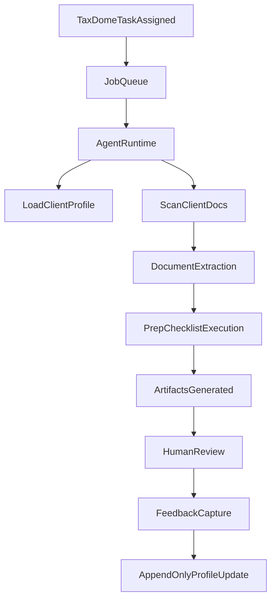

---
name: rookie-master-spec
overview: Comprehensive, self-contained master spec for Rookie, covering phased delivery, system architecture, workflows, data model, integrations, and appendices for client schema, error handling, and feedback mechanisms based solely on the discovery interview and CPA README.
todos: []
isProject: false
---

# Rookie Master Spec

## 1) Product Summary

Rookie is an AI employee for CPA firms. It prepares tax and bookkeeping work products that mirror junior staff output, then hands off to human reviewers. The system earns trust through staged complexity, explicit review, and learning from corrections. v1 is single-firm only; human review remains the final gate; no direct client communication.

## 2) Goals and Non-Goals

- **Goals**
  - Deliver staff-equivalent work products for tax prep and bookkeeping.
  - Integrate into existing workflows (TaxDome, Drake, QuickBooks Online).
  - Maintain a durable, append-only client knowledge profile.
  - Provide transparent status and auditability of AI work.
  - Enable learning from human corrections without forcing extra annotation.
- **Non-Goals (v1)**
  - Multi-firm tenancy.
  - Full automation of Drake data entry (start with worksheets).
  - Direct client communication.
  - Formal compliance certifications (SOC 2 later).

## 3) Phased Delivery Roadmap

Each phase is incremental and builds on shared infrastructure. Phases can overlap where practical.

### Phase 0: Foundation and Governance

- Define firm-level configuration, access control, and audit logging.
- Implement append-only client profile log and retention policy (3-year detailed window).
- Establish document ingestion and storage conventions (local folders synced to cloud).

### Phase 1: Core Platform

- **API and orchestration**: FastAPI backend with job orchestration, task states, and agent runtime hooks.
- **Persistence**: PostgreSQL for structured data, Redis for caching and job status, pgvector for RAG.
- **LLM abstraction**: multi-provider interface (Claude, OpenAI, Gemini) with model routing and cost tracking.
- **Artifacts**: standardized output bundles (worksheets, preparer notes, variance reports).

### Phase 2: Personal Tax (1040) Agent

- Implement personal-tax skill file structure and checklist execution.
- Document extraction for 1040 inputs using LLM vision and existing classification results.
- Produce Drake-ready worksheet and preparer notes.
- Prior-year comparison and variance flags.
- Human review workflow and feedback capture.

### Phase 3: Business Tax Agent

- Add business return workflows (1120, 1120-S, 1065).
- Add K-1 schedules and basis tracking artifacts.
- Expand extraction to business-specific documents.

### Phase 4: Bookkeeping Agent

- QBO data pull and CSV fallback.
- Categorization, reconciliation reports, month-end checklists.
- Prepare review support artifacts for staff.

### Phase 5: Checker Agent (Review Support)

- Compare outputs to source documents and prior-year expected outcomes.
- Produce verification reports and flags (no final approval authority).

### Phase 6: Integrations Expansion

- TaxDome API integration or email-based task ingestion.
- Drake automation path: start with worksheets, evaluate GruntWorx XML after accuracy proof.
- Enhanced GAAPT linkage for document classification/extraction.

### Phase 7: Monitoring UI

- Status dashboard for CPA oversight with step-level progress, blocking reasons, and artifacts.

### Phase 8: Multi-Firm and Compliance

- Multi-tenant architecture and formal compliance roadmap.
- Expanded security controls and audit readiness.

## 4) System Architecture

### 4.1 Components

- **API service**: FastAPI backend for orchestration, task management, and data access.
- **Agent runtime**: stateless worker processes executing checklists and producing artifacts.
- **Document pipeline**: ingestion, classification, extraction, and normalization.
- **Data stores**:
  - PostgreSQL for core entities and audit logs.
  - Redis for job states and transient context.
  - pgvector for RAG over documents, skills, and profiles.
- **Integrations**: TaxDome, QBO, Drake (worksheet-based), GAAPT.
- **Dashboard**: CPA monitoring UI (phase 7).

### 4.2 Core Data Flow (high level)

## 5) Core Workflow (Personal Tax Example)

1. Load client profile (latest derived view from append-only log).
2. Load personal-tax skill file and checklist.
3. Scan client folder for current-year documents.
4. Extract data from source documents using vision.
5. Execute preparation checklist.
6. Produce Drake worksheet and preparer notes.
7. Compare against prior-year return; flag significant changes.
8. Update status and wait for human review.
9. Capture feedback (implicit and optional explicit tags).
10. Append updates to client profile log.

## 6) Data Model (Conceptual)

- **Client**: core identity and firm linkage.
- **TaxYear**: year-specific context for a client.
- **ClientProfileLog**: append-only entries with timestamp, author, type, and content.
- **ClientProfileView**: derived current state (materialized view or computed on read).
- **Document**: file metadata, type, source, and storage reference.
- **Extraction**: structured data extracted from documents with confidence scores.
- **Task**: work assignment (TaxDome or internal) with status.
- **Job**: execution instance of a task (restartable from scratch).
- **Artifact**: outputs (worksheets, preparer notes, variance report).
- **Feedback**: implicit diff or explicit tags linked to artifacts and tasks.
- **AuditEvent**: immutable log of actions and state changes.

## 7) Integrations

- **TaxDome**
  - v1: task assignment via API or email ingestion.
  - Status updates back to TaxDome for workflow continuity.
- **QuickBooks Online**
  - Primary: API-based data pull.
  - Fallback: CSV batch processing.
- **Drake**
  - Primary: structured worksheet output for human entry.
  - Future: GruntWorx XML import after reliability proof.
- **GAAPT**
  - Use existing classification and extraction results where available.
  - Maintain independence for v1.

## 8) Observability and Monitoring

- Per-task status states: queued, running, awaiting_human, blocked, failed, completed.
- Step-level progress visibility and timestamps.
- Human-readable activity log (like asking a staff member for an update).
- Metrics: throughput, error rates, average review time, correction frequency.

## 9) Security and Compliance (v1 baseline)

- No PII used for model training.
- Data stays within firm-controlled systems.
- Access controls with least privilege and audit logging.
- Encrypted storage at rest and in transit (implementation required in Phase 0/1).
- Compliance certifications postponed until core product proves out.

## 10) Validation Strategy

- Start with simple 1040 returns.
- Parallel prep: AI and human produce outputs; compare and reconcile.
- Increase complexity only after accuracy is proven.
- Treat AI onboarding like junior staff training.

## 11) Appendices

### Appendix A: Client Profile Schema Reference

The client profile is a structured, append-only profile derived from log entries. This schema is the minimal reference needed for implementation and agent prompting.

- **Identification**
  - client_id, full_name, date_of_birth, ssn_last4, entity_type
- **ContactInfo**
  - primary_address, mailing_address, phone, email, preferred_contact_method
- **Household**
  - filing_status, spouse, dependents, caregivers, household_changes
- **IncomeSources**
  - wages (W-2), contractor (1099), K-1s, interest, dividends, rental, business_income, other_income
- **DeductionsAndCredits**
  - itemized_deductions, standard_deduction, credits_claimed, carryovers
- **TaxPlanningHistory**
  - prior_plans, elections, entity_changes, prior_advice
- **HistoricalReturnSummary**
  - prior_year_agi, total_tax, refund_or_owed, key_variances, notable_events
- **ClientPreferences**
  - filing_preferences, documentation_habits, communication_style, deadlines
- **RedFlags**
  - compliance_risks, missing_docs_patterns, prior_audit_issues
- **PlanningOpportunities**
  - potential_deductions, timing_strategies, entity_structures
- **ProfileRetentionPolicy**
  - detailed_entries_last_3_years
  - archived_summary_prior_years

### Appendix B: Error Handling and Escalation

- **Principles**
  - Never guess on ambiguous inputs.
  - Escalate to human, then wait for instruction.
  - Restart tasks from the beginning on crash (no partial recovery).
- **Error Taxonomy**
  - **DocumentMissing**: required document not found -> request human input.
  - **ExtractionUncertain**: low confidence -> flag and request confirmation.
  - **DataConflict**: conflicting values across sources -> flag discrepancy.
  - **ValidationFailed**: computed values fail checks -> halt and escalate.
  - **IntegrationFailure**: API/connector error -> retry with backoff, then pause.
  - **LLMFailure**: model timeout or error -> retry, switch provider if needed.
- **Escalation Flow**
  - Log error -> set task status to awaiting_human -> notify reviewer -> resume only with explicit instruction.

### Appendix C: Feedback Mechanisms

- **Implicit Feedback**
  - Diff AI artifacts against final submitted versions.
  - Store changed fields, deltas, and correction types.
- **Explicit Feedback**
  - Optional tags on corrections (misclassified, missing_context, judgment_call).
  - Free-text notes only when reviewer chooses.
- **Learning Pipeline**
  - Scheduled review cycles update prompts/skills, RAG indices, and extraction rules.
  - Feedback used to enrich client profiles and improve checklists.