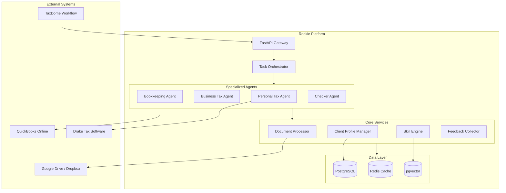
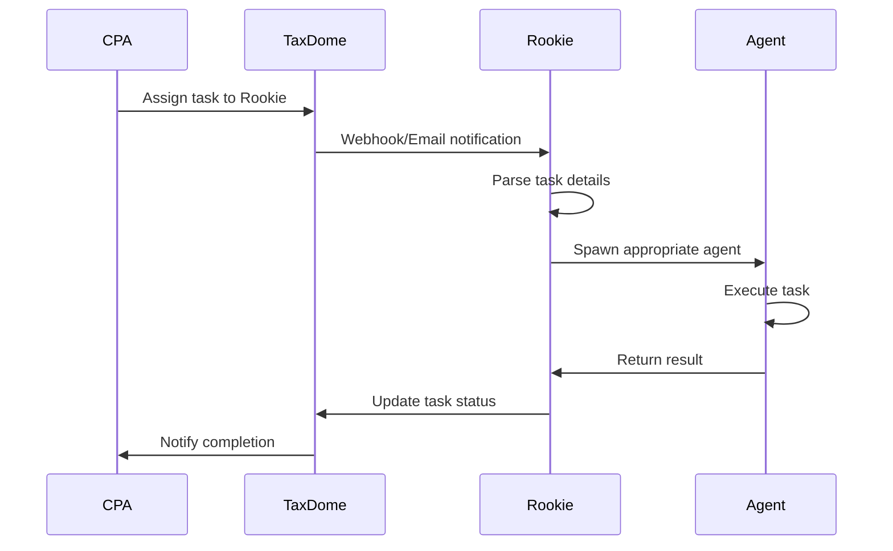
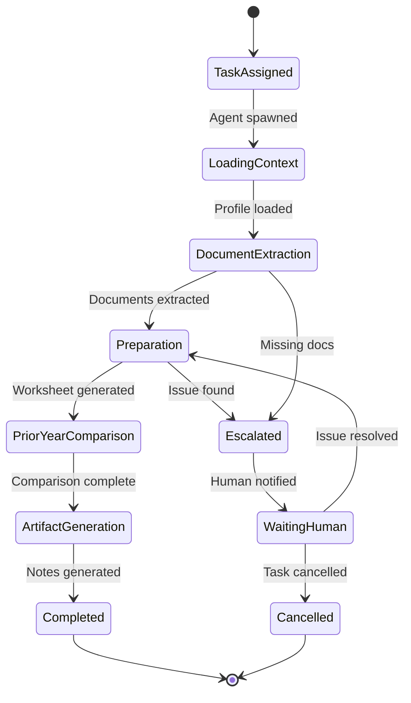
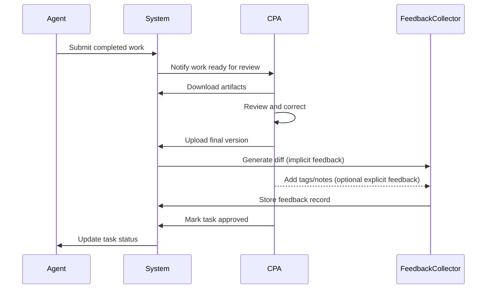

```mermaid
flowchart LR
    A[Load Client Profile] --> B[Load 1040 Skill]
    B --> C[Scan Client Folder]
    C --> D[Extract Document Data]
    D --> E[Execute Preparation Checklist]
    E --> F[Generate Drake Worksheet]
    F --> G[Compare to Prior Year]
    G --> H[Flag Significant Changes]
    H --> I[Produce Preparer Notes]
    I --> J[Update Task Status]
```

# Rookie: AI Employee Platform for CPA Firms

## Master Specification v1.0

---

## 1. Executive Summary

Rookie is an AI employee platform that performs accounting work for CPA firms. Unlike chatbots or narrow automation tools, Rookie operates as a full workflow participant: it reads source documents, understands client history, follows firm procedures, and produces professional work products ready for human review.

**Core Philosophy**: Treat the AI exactly like a new hire. Mistakes are expected, feedback is provided, performance improves over time. The CPA remains professionally liable; Rookie prepares, humans sign.

---

## 2. System Architecture

### 2.1 High-Level Architecture



### 2.2 Technology Stack

| Component | Technology | Rationale |

|-----------|------------|-----------|

| **Language** | Python 3.11+ | Best AI/ML ecosystem, mature agent frameworks |

| **API Framework** | FastAPI | Async support, automatic OpenAPI docs, type validation |

| **Database** | PostgreSQL 15+ | Robust, supports JSON, extensible |

| **Vector Store** | pgvector | Integrated with PostgreSQL, no separate service |

| **Cache/Queue** | Redis | Real-time status, pub/sub for events |

| **LLM Providers** | Claude, GPT, Gemini | API-based, use appropriate model per task |

| **Document Processing** | LLM Vision APIs | Extract data from PDFs, images |

### 2.3 Deployment Model

- **Single-firm deployment** for v1 (multi-tenancy deferred)
- Horizontal scaling via agent instance replication
- Stateless API layer, state persisted in PostgreSQL/Redis
- Background task processing via async workers

---

## 3. Core Modules

### 3.1 Task Orchestrator

**Purpose**: Route tasks to appropriate agents, manage execution lifecycle, handle failures.

**Responsibilities**:

- Receive task assignments from TaxDome (via API or email notification)
- Match tasks to agent types based on work classification
- Spawn agent instances for execution
- Monitor execution progress and update status
- Handle failures with restart-from-beginning policy
- Manage human interrupts (cancel confirmation, no speculative continuation)

**Task States**:

```
PENDING → ASSIGNED → IN_PROGRESS → COMPLETED
                   ↓              ↓
              ESCALATED      FAILED → RESTARTING
                   ↓
              WAITING_HUMAN
```

### 3.2 Document Processor

**Purpose**: Ingest, classify, and extract data from client documents.

**Capabilities**:

- Monitor client folders in cloud storage (Google Drive/Dropbox)
- Classify document types (W-2, 1099, K-1, bank statement, etc.)
- Extract structured data using LLM vision
- Assign confidence scores to extracted values
- Store extraction results with source references

**Document Flow**:

```
CloudStorage → Folder Monitor → Document Classifier → Data Extractor → Extraction Store
```

**Output Format**:

```python
@dataclass
class ExtractedDocument:
    document_id: str
    document_type: str  # "W2", "1099-INT", "K1", etc.
    client_id: str
    tax_year: int
    file_path: str
    extracted_fields: dict[str, ExtractedField]
    extraction_confidence: float  # 0.0 - 1.0
    extracted_at: datetime
    
@dataclass
class ExtractedField:
    field_name: str
    value: Any
    confidence: float
    source_location: str  # "page 1, box 1"
```

### 3.3 Client Profile Manager

**Purpose**: Maintain living client documents that grow over years.

**Design Principles**:

- Append-only log structure (no overwrites, no conflicts)
- 3-year detailed retention, older data archived
- Summary template with key information, not exhaustive records
- Static info (name, DOB) separate from annual updates

**Profile Entry Structure**:

```python
@dataclass
class ProfileEntry:
    entry_id: str
    client_id: str
    timestamp: datetime
    author: str  # "human:john.cpa" or "agent:personal_tax"
    entry_type: str  # "income_update", "flag_added", "preference_change"
    tax_year: int | None
    content: dict
    source_reference: str | None  # meeting notes, document, etc.
```

**Operations**:

- `load_profile(client_id)` → Returns current state derived from log
- `append_entry(client_id, entry)` → Adds new entry
- `get_history(client_id, start_date, end_date)` → Returns entries in range
- `archive_old_entries(client_id, before_year)` → Moves entries to cold storage

### 3.4 Skill Engine

**Purpose**: Manage domain expertise as versioned, searchable skill files.

**Skill File Structure**:

```markdown
# Skill: Personal Tax 1040 Preparation

**Version**: 2026.1
**Effective Date**: 2026-01-01
**Domain**: personal_tax

## Applicable Scenarios
- Individual income tax returns (Form 1040)
- Standard and itemized deductions
- Common schedules (A, B, C, D, E, SE)

## Preparation Checklist
1. Load client profile and prior year return
2. Scan current year documents
3. Extract income from all sources
4. Apply standard vs itemized deduction analysis
5. Calculate credits (child tax, education, etc.)
6. Generate Drake worksheet
7. Compare to prior year and flag variances

## Decision Rules
- If capital gains > $10,000, flag for review
- If self-employment income present, verify SE tax
- If rental income, ensure depreciation schedule exists

## Output Requirements
- Drake worksheet (Excel format)
- Preparer notes (summary, sources, flags, assumptions)
```

**Versioning**:

- Version format: `YYYY.N` (year.revision)
- Skills updated annually for tax law changes
- Old versions retained for prior-year work

### 3.5 Feedback Collector

**Purpose**: Capture CPA corrections to improve AI performance.

**Two-Layer Approach**:

1. **Implicit Feedback** (automatic):

                                                                                                                                                                                                                                                                                                                                                                                                                                                                                                                                                                                                                                                                                                                                                                                                                                                                                                                                                                                                                                                                                                                                                                                                                                                                                                                                                                                                                                                                                                                                                                                                - Diff AI draft against final submitted version
                                                                                                                                                                                                                                                                                                                                                                                                                                                                                                                                                                                                                                                                                                                                                                                                                                                                                                                                                                                                                                                                                                                                                                                                                                                                                                                                                                                                                                                                                                                                                                                                - Track what changed, where, and magnitude
                                                                                                                                                                                                                                                                                                                                                                                                                                                                                                                                                                                                                                                                                                                                                                                                                                                                                                                                                                                                                                                                                                                                                                                                                                                                                                                                                                                                                                                                                                                                                                                                - Store diffs with task context for pattern analysis

2. **Explicit Feedback** (optional):

                                                                                                                                                                                                                                                                                                                                                                                                                                                                                                                                                                                                                                                                                                                                                                                                                                                                                                                                                                                                                                                                                                                                                                                                                                                                                                                                                                                                                                                                                                                                                                                                - Lightweight review tags when CPA explains corrections
                                                                                                                                                                                                                                                                                                                                                                                                                                                                                                                                                                                                                                                                                                                                                                                                                                                                                                                                                                                                                                                                                                                                                                                                                                                                                                                                                                                                                                                                                                                                                                                                - Tags: `misclassified`, `missing_context`, `judgment_call`, `data_error`, `calculation_error`
                                                                                                                                                                                                                                                                                                                                                                                                                                                                                                                                                                                                                                                                                                                                                                                                                                                                                                                                                                                                                                                                                                                                                                                                                                                                                                                                                                                                                                                                                                                                                                                                - Free-text note field for nuanced explanations

**Feedback Storage**:

```python
@dataclass
class FeedbackRecord:
    task_id: str
    agent_type: str
    client_id: str
    tax_year: int
    draft_artifact_id: str
    final_artifact_id: str
    implicit_diff: dict  # structured diff
    explicit_tags: list[str]
    explicit_notes: str | None
    reviewer_id: str
    recorded_at: datetime
```

---

## 4. Agent Specifications

### 4.1 Common Agent Interface

All agents share:

```python
class BaseAgent(ABC):
    agent_type: str
    skill_files: list[str]
    
    @abstractmethod
    async def execute(self, task: Task, context: AgentContext) -> TaskResult:
        """Execute the assigned task."""
        pass
    
    async def load_client_profile(self, client_id: str) -> ClientProfile:
        """Load client profile from Profile Manager."""
        pass
    
    async def load_skills(self) -> list[Skill]:
        """Load relevant skill files from Skill Engine."""
        pass
    
    async def extract_documents(self, folder_path: str) -> list[ExtractedDocument]:
        """Extract data from client documents."""
        pass
    
    async def escalate(self, issue: str, context: dict) -> None:
        """Escalate to human and wait for instructions."""
        pass
    
    async def produce_artifact(self, artifact_type: str, content: Any) -> Artifact:
        """Generate output artifact."""
        pass
```

### 4.2 Personal Tax Agent

**Domain**: Individual income tax returns (Form 1040)

**Capabilities**:

- Process W-2s, 1099s (all types), K-1s
- Handle Schedules A, B, C, D, E, SE
- Calculate standard vs. itemized deduction
- Apply credits (child tax, education, EIC, etc.)
- Generate Drake worksheet in Excel format

**Execution Flow**:



**Output Artifacts**:

1. **Drake Worksheet** (Excel): Maps to Drake input screens
2. **Preparer Notes** (Markdown):

                                                                                                                                                                                                                                                                                                                                                                                                                                                                                                                                                                                                                                                                                                                                                                                                                                                                                                                                                                                                                                                                                                                                                                                                                                                                                                                                                                                                                                                                                                                                                                                                - Summary (AGI, total tax, refund/owed, YoY comparison)
                                                                                                                                                                                                                                                                                                                                                                                                                                                                                                                                                                                                                                                                                                                                                                                                                                                                                                                                                                                                                                                                                                                                                                                                                                                                                                                                                                                                                                                                                                                                                                                                - Data sources with confidence levels
                                                                                                                                                                                                                                                                                                                                                                                                                                                                                                                                                                                                                                                                                                                                                                                                                                                                                                                                                                                                                                                                                                                                                                                                                                                                                                                                                                                                                                                                                                                                                                                                - Flags/questions for reviewer
                                                                                                                                                                                                                                                                                                                                                                                                                                                                                                                                                                                                                                                                                                                                                                                                                                                                                                                                                                                                                                                                                                                                                                                                                                                                                                                                                                                                                                                                                                                                                                                                - Assumptions made with reasoning
                                                                                                                                                                                                                                                                                                                                                                                                                                                                                                                                                                                                                                                                                                                                                                                                                                                                                                                                                                                                                                                                                                                                                                                                                                                                                                                                                                                                                                                                                                                                                                                                - Suggested review focus areas

### 4.3 Business Tax Agent

**Domain**: Business entity returns (1120, 1120-S, 1065)

**Capabilities**:

- Process corporate/partnership financials
- Generate K-1 schedules for pass-through entities
- Track shareholder/partner basis
- Handle depreciation schedules
- Reconcile book-to-tax differences

**Execution Flow**:


**Additional Artifacts**:

- K-1 worksheets for each partner/shareholder
- Basis calculation workpapers
- Book-tax reconciliation summary

### 4.4 Bookkeeping Agent

**Domain**: Transaction categorization and reconciliation

**Capabilities**:

- Categorize bank and credit card transactions
- Perform monthly reconciliations
- Generate month-end checklists
- Produce financial statement drafts
- Flag unusual transactions

**Integration**: QuickBooks Online via API (CSV fallback)

**Execution Flow**:


**Output Artifacts**:

- Categorization summary with confidence scores
- Reconciliation report
- Flagged transactions list
- Month-end checklist status

### 4.5 Checker Agent

**Domain**: Quality verification (not approval authority)

**Capabilities**:

- Verify numbers match source documents
- Ensure inputs are correctly entered
- Compare to prior year and flag variances
- Validate logical consistency
- Generate review summary

**Authority**: Can approve or flag, but human reviewer is always final gate.

**Checker Logic**:

```python
async def check_return(self, prepared_return: Artifact, sources: list[ExtractedDocument]) -> CheckerReport:
    issues = []
    
    # Verify source document matches
    for field, value in prepared_return.fields.items():
        source_value = self.find_source_value(field, sources)
        if source_value and value != source_value:
            issues.append(Issue(field, "source_mismatch", value, source_value))
    
    # Compare to prior year
    prior_return = await self.load_prior_year(prepared_return.client_id)
    variances = self.calculate_variances(prepared_return, prior_return)
    for variance in variances:
        if variance.percentage > 0.20 and not self.has_explanation(variance):
            issues.append(Issue(variance.field, "unexplained_variance", variance))
    
    return CheckerReport(
        status="APPROVED" if not issues else "FLAGGED",
        issues=issues,
        review_focus=self.suggest_focus_areas(issues)
    )
```

---

## 5. Integration Specifications

### 5.1 TaxDome Integration

**Purpose**: Receive task assignments, update workflow status.

**Options**:

1. **API Integration** (preferred if available)
2. **Email Notification**: Assign AI employee an email address

**Task Assignment Flow**:



**Status Mapping**:

| Rookie Status | TaxDome Status |

|---------------|----------------|

| PENDING | Assigned |

| IN_PROGRESS | In Progress |

| ESCALATED | Needs Attention |

| COMPLETED | Ready for Review |

### 5.2 Drake Tax Integration

**Strategy**: Graduated approach starting with manual entry from AI-generated worksheets.

**Phase 1 (Current)**: Excel Worksheet Output

- AI produces structured Excel workbook
- Maps fields to Drake input screens
- Human enters data using worksheet as guide
- Most controllable, easiest to verify

**Phase 2 (Future)**: CSV Import

- Schedule D/8949 trades via CSV
- Batch import where Drake supports it

**Phase 3 (Future)**: XML/GruntWorx Integration

- Direct data population via XML
- Requires schema reverse-engineering
- Only after accuracy is proven

**Drake Worksheet Format**:

```
Sheet 1: Summary
- Client name, SSN (masked), Tax Year
- Return type, filing status
- Key figures (AGI, Total Tax, Refund/Due)

Sheet 2: Income
- W-2 income (one row per W-2)
- 1099-INT/DIV summary
- Schedule C income
- Rental income summary
- Capital gains summary

Sheet 3: Deductions
- Standard vs Itemized analysis
- Itemized breakdown if applicable
- Above-the-line deductions

Sheet 4: Credits
- Child tax credit calculations
- Education credits
- Other applicable credits

Sheet 5: Source References
- Document → Field mapping
- Confidence scores
- Page/box references
```

### 5.3 QuickBooks Online Integration

**Primary Method**: Direct API

```python
class QBOConnector:
    async def connect(self, credentials: QBOCredentials) -> QBOSession:
        """Establish OAuth connection to QBO."""
        pass
    
    async def get_transactions(
        self, 
        start_date: date, 
        end_date: date,
        account_ids: list[str] | None = None
    ) -> list[Transaction]:
        """Fetch transactions for date range."""
        pass
    
    async def categorize_transaction(
        self, 
        transaction_id: str, 
        category: str,
        memo: str | None = None
    ) -> None:
        """Update transaction category in QBO."""
        pass
    
    async def create_journal_entry(self, entry: JournalEntry) -> str:
        """Create journal entry, return entry ID."""
        pass
```

**Fallback Method**: CSV Export/Import

- Export transactions from QBO
- Process locally
- Generate import file for batch updates

### 5.4 Cloud Storage Integration

**Supported Providers**: Google Drive, Dropbox

**Folder Structure Convention**:

```
ClientRoot/
├── {ClientID}_{ClientName}/
│   ├── 2024/
│   │   ├── Source Documents/
│   │   │   ├── W2_Employer1.pdf
│   │   │   ├── 1099-INT_Bank.pdf
│   │   │   └── ...
│   │   ├── Workpapers/
│   │   └── Final/
│   ├── 2025/
│   │   └── ...
│   └── 2026/
│       └── ...
```

**Folder Monitor**:

- Watch for new documents in Source Documents folder
- Trigger document classification and extraction
- Notify agent when client folder is ready

---

## 6. Data Models

### 6.1 Client Profile Schema

```python
@dataclass
class ClientProfile:
    # Identification
    client_id: str
    primary_taxpayer: TaxpayerInfo
    spouse: TaxpayerInfo | None
    filing_status: FilingStatus
    
    # Contact
    address: Address
    phone: str
    email: str
    preferred_contact_method: str
    
    # Household
    dependents: list[Dependent]
    
    # Income Sources (updated annually)
    income_sources: list[IncomeSource]
    
    # Deductions & Credits
    deduction_preference: str  # "standard" | "itemized" | "analyze"
    recurring_deductions: list[RecurringDeduction]
    credit_eligibility: list[str]
    
    # Tax Planning
    estimated_payments: list[EstimatedPayment]
    withholding_adjustments: list[str]
    planning_notes: list[PlanningNote]
    
    # Historical
    return_history: list[ReturnSummary]  # Last 3 years
    
    # Preferences & Flags
    preferences: ClientPreferences
    red_flags: list[RedFlag]
    planning_opportunities: list[PlanningOpportunity]
    
    # Audit Log
    profile_entries: list[ProfileEntry]  # Append-only

@dataclass
class TaxpayerInfo:
    legal_name: str
    ssn_last_four: str  # Only store last 4, full SSN in secure vault
    date_of_birth: date
    occupation: str

@dataclass
class IncomeSource:
    source_type: str  # "W2", "1099-NEC", "K1", "Rental", etc.
    description: str
    payer_name: str
    ein_or_id: str | None
    typical_amount: float
    notes: str | None

@dataclass
class ReturnSummary:
    tax_year: int
    filing_status: str
    agi: float
    total_tax: float
    refund_or_due: float
    significant_items: list[str]
    preparer_notes: str | None

@dataclass
class RedFlag:
    flag_type: str
    description: str
    tax_years_affected: list[int]
    resolution_status: str
    notes: str

@dataclass
class ClientPreferences:
    communication_style: str
    deadline_sensitivity: str  # "extension_ok" | "must_file_on_time"
    document_delivery: str  # "email" | "portal" | "mail"
    special_instructions: list[str]
```

### 6.2 Task Schema

```python
@dataclass
class Task:
    task_id: str
    task_type: str  # "1040_prep", "1120s_prep", "bookkeeping_monthly"
    client_id: str
    tax_year: int | None
    assigned_agent: str
    assigned_by: str  # CPA user ID
    assigned_at: datetime
    status: TaskStatus
    priority: int
    
    # Execution
    started_at: datetime | None
    completed_at: datetime | None
    execution_log: list[ExecutionEntry]
    
    # Results
    artifacts: list[Artifact]
    escalations: list[Escalation]
    
    # Metadata
    source_system: str  # "taxdome", "manual"
    external_reference: str | None  # TaxDome task ID

@dataclass
class Artifact:
    artifact_id: str
    artifact_type: str  # "drake_worksheet", "preparer_notes", "reconciliation_report"
    file_path: str
    created_at: datetime
    created_by: str  # agent ID
    content_hash: str
    
@dataclass
class Escalation:
    escalation_id: str
    issue_type: str
    description: str
    context: dict
    escalated_at: datetime
    resolved_at: datetime | None
    resolution: str | None
    resolved_by: str | None
```

### 6.3 Skill File Schema

```yaml
# skill.yaml
metadata:
  name: "Personal Tax 1040 Preparation"
  version: "2026.1"
  effective_date: "2026-01-01"
  domain: "personal_tax"
  applicable_forms:
  - "1040"
  - "Schedule A"
  - "Schedule B"
  - "Schedule C"
  - "Schedule D"
  - "Schedule E"
  - "Schedule SE"

prerequisites:
 - client_profile_loaded
 - prior_year_return_available
 - source_documents_scanned

checklist:
 - id: "load_context"
    description: "Load client profile and prior year return"
    required: true
    
 - id: "scan_documents"
    description: "Scan client folder for current year documents"
    required: true
    
 - id: "extract_income"
    description: "Extract income from all source documents"
    required: true
    
 - id: "apply_deductions"
    description: "Analyze and apply standard vs itemized deductions"
    required: true
    
 - id: "calculate_credits"
    description: "Calculate applicable credits"
    required: true
    
 - id: "generate_worksheet"
    description: "Generate Drake worksheet"
    required: true
    
 - id: "prior_year_comparison"
    description: "Compare to prior year and flag variances"
    required: true
    
 - id: "produce_notes"
    description: "Generate preparer notes"
    required: true

decision_rules:
 - condition: "capital_gains > 10000"
    action: "flag_for_review"
    reason: "Significant capital gains require additional review"
    
 - condition: "self_employment_income_present"
    action: "verify_se_tax"
    reason: "Ensure SE tax calculated correctly"
    
 - condition: "rental_income_present"
    action: "verify_depreciation"
    reason: "Confirm depreciation schedule exists and is current"
    
 - condition: "agi_change_percentage > 20"
    action: "flag_significant_change"
    reason: "Large AGI swing requires explanation"

escalation_triggers:
 - "missing_required_document"
 - "conflicting_information"
 - "complex_transaction"
 - "potential_audit_risk"

outputs:
 - type: "drake_worksheet"
    format: "xlsx"
    required: true
    
 - type: "preparer_notes"
    format: "md"
    required: true
```

---

## 7. Workflow Definitions

### 7.1 Standard Tax Preparation Workflow



### 7.2 Review and Feedback Workflow



### 7.3 Multi-Year Client Handling

Clients may have multiple years in progress simultaneously. The AI maintains visibility across all years:

```
ClientFolder/
├── 2024/  → May have amendments
├── 2025/  → Prior year reference
└── 2026/  → Current year in preparation
```

Each year's work is distinct, but the agent can:

- Reference prior years for comparison
- Identify carryforward items
- Flag multi-year planning opportunities

---

## 8. Error Handling

### 8.1 Error Categories

| Category | Examples | Handling |

|----------|----------|----------|

| **Recoverable** | Network timeout, API rate limit | Retry with backoff |

| **Data Quality** | Missing document, unclear scan | Escalate with context |

| **Business Logic** | Conflicting information, unusual pattern | Escalate for guidance |

| **Fatal** | Agent crash, database unavailable | Restart task from beginning |

### 8.2 Escalation Protocol

```python
@dataclass
class Escalation:
    issue_type: str  # "missing_document", "conflicting_info", "complex_transaction"
    description: str
    context: dict
    suggested_actions: list[str]
    blocking: bool  # Can agent proceed with other work?

async def handle_escalation(escalation: Escalation, task: Task) -> None:
    # 1. Log escalation
    await log_escalation(task.task_id, escalation)
    
    # 2. Update task status
    task.status = TaskStatus.ESCALATED
    await update_task(task)
    
    # 3. Notify human
    await notify_assignee(
        task.assigned_by,
        subject=f"Escalation: {task.task_id}",
        body=format_escalation_email(escalation, task)
    )
    
    # 4. Determine next action
    if not escalation.blocking:
        # Move to other available tasks
        await task_orchestrator.assign_next_task(task.assigned_agent)
    else:
        # Wait for human resolution
        await set_agent_status(task.assigned_agent, "waiting")
```

### 8.3 Failure Recovery

**Policy**: Restart from beginning on failure. No partial state recovery.

**Rationale**:

- Simpler implementation
- More reliable outcomes
- Avoids corrupted intermediate states
- Tasks are designed to be atomic
```python
async def handle_agent_failure(task: Task, error: Exception) -> None:
    # Log failure details
    await log_failure(task.task_id, error)
    
    # Increment retry count
    task.retry_count += 1
    
    if task.retry_count < MAX_RETRIES:
        # Reset and retry
        task.status = TaskStatus.PENDING
        task.execution_log = []  # Clear partial work
        await update_task(task)
        await task_orchestrator.schedule_retry(task)
    else:
        # Escalate to human after max retries
        await handle_escalation(
            Escalation(
                issue_type="repeated_failure",
                description=f"Task failed {MAX_RETRIES} times",
                context={"last_error": str(error)},
                suggested_actions=["manual_review", "reassign"],
                blocking=True
            ),
            task
        )
```


### 8.4 Human Interrupt Handling

When a CPA redirects an AI mid-task:

```python
async def handle_interrupt(task: Task, new_instruction: str) -> None:
    # 1. Pause current execution
    await pause_agent(task.assigned_agent)
    
    # 2. Request confirmation
    confirmation = await request_human_confirmation(
        task.assigned_by,
        message=f"Cancel current task '{task.task_id}' and process new instruction?",
        options=["cancel_and_proceed", "continue_current", "queue_new"]
    )
    
    # 3. Execute based on response
    if confirmation == "cancel_and_proceed":
        await cancel_task(task)
        await process_new_instruction(new_instruction)
    elif confirmation == "continue_current":
        await resume_agent(task.assigned_agent)
    elif confirmation == "queue_new":
        await queue_instruction(new_instruction)
        await resume_agent(task.assigned_agent)
```

---

## 9. Feedback Mechanisms

### 9.1 Implicit Feedback Collection

Automatic diff generation between AI draft and final version:

```python
async def collect_implicit_feedback(
    task_id: str,
    draft_artifact: Artifact,
    final_artifact: Artifact
) -> ImplicitFeedback:
    # Load both versions
    draft_content = await load_artifact_content(draft_artifact)
    final_content = await load_artifact_content(final_artifact)
    
    # Generate structured diff
    diff = generate_structured_diff(draft_content, final_content)
    
    # Categorize changes
    categorized_changes = categorize_changes(diff)
    
    return ImplicitFeedback(
        task_id=task_id,
        total_changes=len(diff.changes),
        changes_by_category=categorized_changes,
        change_magnitude=calculate_magnitude(diff),
        diff_details=diff
    )

@dataclass
class CategorizedChange:
    category: str  # "income", "deduction", "credit", "calculation"
    field_path: str
    draft_value: Any
    final_value: Any
    change_type: str  # "added", "removed", "modified"
```

### 9.2 Explicit Feedback Interface

Optional lightweight tagging:

```python
# Available feedback tags
FEEDBACK_TAGS = [
    "misclassified",      # Wrong category/account
    "missing_context",    # AI didn't have enough info
    "judgment_call",      # Subjective decision
    "data_error",         # Extracted wrong value
    "calculation_error",  # Math was wrong
    "formatting_issue",   # Output format problem
    "prior_year_miss",    # Didn't reference prior year correctly
]

@dataclass
class ExplicitFeedback:
    task_id: str
    reviewer_id: str
    tags: list[str]
    notes: str | None  # Optional free-text explanation
    specific_items: list[FeedbackItem]  # Link tags to specific fields

@dataclass
class FeedbackItem:
    field_path: str
    tag: str
    note: str | None
```

### 9.3 Feedback Application

**Current Approach**: Store feedback for periodic analysis and manual skill file updates.

**Future Approach** (TBD):

- RAG over feedback corpus for similar situations
- Fine-tuning/RLHF pipeline
- Automated skill file suggestions
```python
async def analyze_feedback_patterns(
    agent_type: str,
    date_range: tuple[date, date]
) -> FeedbackAnalysis:
    # Aggregate feedback for agent type
    feedback_records = await get_feedback(agent_type, date_range)
    
    # Identify common patterns
    patterns = identify_patterns(feedback_records)
    
    # Generate recommendations
    recommendations = generate_recommendations(patterns)
    
    return FeedbackAnalysis(
        total_tasks=len(feedback_records),
        accuracy_rate=calculate_accuracy(feedback_records),
        common_issues=patterns.top_issues,
        improvement_recommendations=recommendations
    )
```


---

## 10. Security Considerations

### 10.1 Core Requirements

| Requirement | Implementation |

|-------------|----------------|

| No PII leakage | SSNs stored separately, only last-4 in profile |

| Audit trail | All actions logged with timestamp and actor |

| Data isolation | Single-firm deployment, no cross-contamination |

| Human approval | All final outputs require CPA sign-off |

| Secure storage | Encryption at rest and in transit |

### 10.2 Data Classification

```python
class DataClassification:
    PUBLIC = "public"           # Firm name, general procedures
    INTERNAL = "internal"       # Skill files, process docs
    CONFIDENTIAL = "confidential"  # Client names, general info
    RESTRICTED = "restricted"   # SSNs, EINs, financial details
```

**Handling by Classification**:

- **RESTRICTED**: Never logged in full, masked in outputs, separate secure storage
- **CONFIDENTIAL**: Access logged, encrypted at rest
- **INTERNAL**: Standard security controls
- **PUBLIC**: No special handling

### 10.3 Access Control

```python
@dataclass
class AccessPolicy:
    resource_type: str  # "client_profile", "task", "artifact"
    allowed_actors: list[str]  # ["agent:personal_tax", "user:john.cpa"]
    allowed_operations: list[str]  # ["read", "write", "delete"]
    conditions: dict | None  # Additional constraints
```

### 10.4 Compliance Roadmap

**v1 (Current)**: Basic security

- No client PII in LLM training data
- Full audit logging
- Encrypted storage

**v2 (Future)**: SOC 2 preparation

- Formal access controls
- Penetration testing
- Compliance documentation

---

## 11. Implementation Phases

### Phase 1: Foundation (Weeks 1-4)

**Goal**: Core infrastructure operational

**Deliverables**:

- FastAPI application skeleton
- PostgreSQL + Redis setup
- Basic data models (Task, Client, Artifact)
- Document processor (vision extraction)
- Cloud storage integration (folder monitoring)
- Logging and monitoring infrastructure

**Milestones**:

- [ ] API accepts task creation requests
- [ ] Documents extracted from client folders
- [ ] Extraction results stored in database

### Phase 2: Personal Tax Agent (Weeks 5-10)

**Goal**: Working 1040 preparation for simple returns

**Deliverables**:

- Client Profile Manager
- Skill Engine with 1040 skill file
- Personal Tax Agent implementation
- Drake worksheet generator (Excel output)
- Preparer notes generator
- Prior year comparison logic

**Milestones**:

- [ ] Agent prepares 1040 from test documents
- [ ] Drake worksheet matches expected format
- [ ] Preparer notes include all required sections
- [ ] Prior year comparison flags variances

### Phase 3: Review Infrastructure (Weeks 11-14)

**Goal**: Feedback loop operational

**Deliverables**:

- Feedback Collector (implicit + explicit)
- Checker Agent implementation
- Status dashboard (basic version)
- TaxDome integration

**Milestones**:

- [ ] CPA can review and provide feedback
- [ ] Diffs captured automatically
- [ ] Checker validates prepared returns
- [ ] Tasks flow through TaxDome

### Phase 4: Business Tax Agent (Weeks 15-20)

**Goal**: 1120/1120-S/1065 preparation

**Deliverables**:

- Business Tax skill files
- Business Tax Agent implementation
- K-1 generation
- Basis tracking worksheets

**Milestones**:

- [ ] Agent prepares business returns
- [ ] K-1s generated for pass-through entities
- [ ] Basis calculations documented

### Phase 5: Bookkeeping Agent (Weeks 21-26)

**Goal**: Monthly bookkeeping automation

**Deliverables**:

- QuickBooks Online integration
- Bookkeeping Agent implementation
- Transaction categorization rules
- Reconciliation workflow
- Month-end checklist automation

**Milestones**:

- [ ] Transactions categorized automatically
- [ ] Reconciliation reports generated
- [ ] QBO updated via API

### Phase 6: Production Hardening (Weeks 27-30)

**Goal**: Production-ready system

**Deliverables**:

- Comprehensive error handling
- Performance optimization
- Security audit and fixes
- Documentation complete
- Operational runbooks

**Milestones**:

- [ ] System handles concurrent tasks
- [ ] Recovery from failures tested
- [ ] Security review passed
- [ ] Team trained on operations

---

## 12. Monitoring and Observability

### 12.1 Status Dashboard

**Purpose**: Let CPAs see exactly where AI is in a project.

**Views**:

1. **Task Queue**: All pending/in-progress tasks
2. **Agent Status**: What each agent is working on
3. **Escalations**: Items awaiting human input
4. **Completed Today**: Recently finished work

**Task Detail**:

```
Task: 1040 Prep - Smith, John (2025)
Status: IN_PROGRESS
Current Step: Prior Year Comparison (Step 6 of 8)
Started: 2h ago
Estimated Remaining: 15 min
Documents Processed: 7/7
Escalations: None
```

### 12.2 Metrics

**Operational Metrics**:

- Tasks completed per day
- Average task duration
- Escalation rate
- Error/retry rate
- Queue depth

**Quality Metrics**:

- Feedback correction rate
- Fields changed in review
- Accuracy by return type
- Accuracy trend over time

### 12.3 Alerting

| Alert | Condition | Action |

|-------|-----------|--------|

| Task Stuck | No progress in 30 min | Notify ops |

| High Escalation Rate | >20% tasks escalated | Review skill files |

| Agent Down | No heartbeat in 5 min | Auto-restart |

| Queue Backup | >50 pending tasks | Scale up agents |

---

## Appendix A: Client Schema Reference

Complete schema with all field definitions:

```python
# Full schema in schemas/client.py

from dataclasses import dataclass, field
from datetime import date, datetime
from enum import Enum
from typing import Optional

class FilingStatus(Enum):
    SINGLE = "single"
    MARRIED_JOINT = "married_filing_jointly"
    MARRIED_SEPARATE = "married_filing_separately"
    HEAD_OF_HOUSEHOLD = "head_of_household"
    QUALIFYING_WIDOW = "qualifying_widow"

class IncomeSourceType(Enum):
    W2 = "w2"
    SELF_EMPLOYMENT = "self_employment"
    RENTAL = "rental"
    INVESTMENT = "investment"
    RETIREMENT = "retirement"
    SOCIAL_SECURITY = "social_security"
    K1_PARTNERSHIP = "k1_partnership"
    K1_SCORP = "k1_scorp"
    K1_TRUST = "k1_trust"
    OTHER = "other"

@dataclass
class Address:
    street1: str
    street2: Optional[str]
    city: str
    state: str
    zip_code: str
    country: str = "USA"

@dataclass
class TaxpayerInfo:
    legal_name: str
    ssn_last_four: str  # Last 4 digits only
    date_of_birth: date
    occupation: str
    employer: Optional[str] = None

@dataclass
class Dependent:
    name: str
    ssn_last_four: str
    relationship: str  # "child", "parent", "other"
    date_of_birth: date
    months_lived_with_taxpayer: int
    student: bool = False
    disabled: bool = False

@dataclass
class IncomeSource:
    source_type: IncomeSourceType
    description: str
    payer_name: str
    ein_or_identifier: Optional[str]
    typical_annual_amount: float
    is_recurring: bool
    first_year: int
    last_year: Optional[int]  # None if ongoing
    notes: Optional[str] = None

@dataclass
class RecurringDeduction:
    deduction_type: str  # "mortgage_interest", "property_tax", "charitable", etc.
    description: str
    typical_annual_amount: float
    payee: Optional[str]
    notes: Optional[str] = None

@dataclass
class EstimatedPayment:
    tax_year: int
    quarter: int  # 1-4
    amount: float
    payment_date: date
    payment_method: str

@dataclass
class ReturnSummary:
    tax_year: int
    filing_status: FilingStatus
    agi: float
    taxable_income: float
    total_tax: float
    withholding: float
    estimated_payments: float
    refund_or_balance_due: float  # Positive = refund
    significant_items: list[str] = field(default_factory=list)
    preparer_notes: Optional[str] = None
    filed_date: Optional[date] = None
    extension_filed: bool = False

@dataclass
class RedFlag:
    flag_id: str
    flag_type: str  # "audit_risk", "prior_issue", "complexity", "compliance"
    description: str
    severity: str  # "low", "medium", "high"
    tax_years_affected: list[int]
    resolution_status: str  # "open", "resolved", "monitoring"
    resolution_notes: Optional[str] = None
    created_at: datetime
    updated_at: datetime

@dataclass
class PlanningOpportunity:
    opportunity_id: str
    category: str  # "retirement", "charitable", "timing", "entity_structure"
    description: str
    estimated_benefit: Optional[float]
    implementation_notes: str
    status: str  # "identified", "discussed", "implemented", "declined"
    identified_date: date
    review_date: Optional[date] = None

@dataclass
class ClientPreferences:
    communication_style: str  # "detailed", "summary", "minimal"
    preferred_contact_method: str  # "email", "phone", "portal"
    deadline_sensitivity: str  # "extension_ok", "prefers_timely", "must_file_on_time"
    document_delivery: str  # "email", "portal", "mail"
    meeting_preference: str  # "in_person", "video", "phone"
    special_instructions: list[str] = field(default_factory=list)

@dataclass
class ProfileEntry:
    """Append-only log entry for client profile changes."""
    entry_id: str
    client_id: str
    timestamp: datetime
    author: str  # "human:john.cpa" or "agent:personal_tax"
    entry_type: str
    tax_year: Optional[int]
    content: dict
    source_reference: Optional[str]  # Meeting notes, document ID, etc.

@dataclass
class ClientProfile:
    """Complete client profile."""
    # Core Identification
    client_id: str
    primary_taxpayer: TaxpayerInfo
    spouse: Optional[TaxpayerInfo]
    filing_status: FilingStatus
    
    # Contact Information
    address: Address
    phone: str
    email: str
    
    # Household
    dependents: list[Dependent] = field(default_factory=list)
    
    # Income Sources
    income_sources: list[IncomeSource] = field(default_factory=list)
    
    # Deductions
    deduction_preference: str = "analyze"  # "standard", "itemized", "analyze"
    recurring_deductions: list[RecurringDeduction] = field(default_factory=list)
    credit_eligibility: list[str] = field(default_factory=list)
    
    # Tax Planning
    estimated_payments: list[EstimatedPayment] = field(default_factory=list)
    withholding_notes: Optional[str] = None
    
    # Historical Data
    return_history: list[ReturnSummary] = field(default_factory=list)
    
    # Flags and Opportunities
    red_flags: list[RedFlag] = field(default_factory=list)
    planning_opportunities: list[PlanningOpportunity] = field(default_factory=list)
    
    # Preferences
    preferences: ClientPreferences = field(default_factory=ClientPreferences)
    
    # Audit Log
    profile_entries: list[ProfileEntry] = field(default_factory=list)
    
    # Metadata
    created_at: datetime = field(default_factory=datetime.now)
    updated_at: datetime = field(default_factory=datetime.now)
    last_return_year: Optional[int] = None
    assigned_cpa: Optional[str] = None
```

---

## Appendix B: Error Code Reference

```python
class ErrorCode(Enum):
    # Document Processing Errors (1xxx)
    DOC_NOT_FOUND = 1001
    DOC_UNREADABLE = 1002
    DOC_UNSUPPORTED_FORMAT = 1003
    DOC_EXTRACTION_FAILED = 1004
    DOC_CLASSIFICATION_FAILED = 1005
    
    # Client Profile Errors (2xxx)
    PROFILE_NOT_FOUND = 2001
    PROFILE_CORRUPT = 2002
    PROFILE_MISSING_REQUIRED = 2003
    
    # Task Errors (3xxx)
    TASK_NOT_FOUND = 3001
    TASK_ALREADY_COMPLETED = 3002
    TASK_CANCELLED = 3003
    TASK_TIMEOUT = 3004
    TASK_DEPENDENCY_FAILED = 3005
    
    # Agent Errors (4xxx)
    AGENT_NOT_AVAILABLE = 4001
    AGENT_SKILL_NOT_FOUND = 4002
    AGENT_EXECUTION_FAILED = 4003
    AGENT_TIMEOUT = 4004
    
    # Integration Errors (5xxx)
    TAXDOME_CONNECTION_FAILED = 5001
    QBO_AUTH_FAILED = 5002
    QBO_API_ERROR = 5003
    STORAGE_ACCESS_DENIED = 5004
    
    # Validation Errors (6xxx)
    VALIDATION_MISSING_DOCUMENT = 6001
    VALIDATION_DATA_MISMATCH = 6002
    VALIDATION_CALCULATION_ERROR = 6003
    
    # System Errors (9xxx)
    DATABASE_ERROR = 9001
    CACHE_ERROR = 9002
    LLM_API_ERROR = 9003
    INTERNAL_ERROR = 9999

@dataclass
class RookieError:
    code: ErrorCode
    message: str
    details: dict | None
    recoverable: bool
    suggested_action: str
```

---

## Appendix C: API Reference

### Task Endpoints

```python
# POST /api/v1/tasks
# Create a new task
{
    "task_type": "1040_prep",
    "client_id": "cli_abc123",
    "tax_year": 2025,
    "priority": 1,
    "assigned_agent": "personal_tax",
    "notes": "Standard return, no special circumstances"
}

# GET /api/v1/tasks/{task_id}
# Get task details and status

# GET /api/v1/tasks?status=in_progress&agent=personal_tax
# List tasks with filters

# POST /api/v1/tasks/{task_id}/escalate
# Escalate task to human
{
    "issue_type": "missing_document",
    "description": "W-2 from employer ABC Corp not found",
    "blocking": true
}

# POST /api/v1/tasks/{task_id}/resolve
# Resolve escalation and resume
{
    "resolution": "Document uploaded to client folder",
    "resume": true
}
```

### Client Endpoints

```python
# GET /api/v1/clients/{client_id}/profile
# Get current client profile

# POST /api/v1/clients/{client_id}/profile/entries
# Add profile entry
{
    "entry_type": "income_update",
    "tax_year": 2025,
    "content": {
        "source_type": "w2",
        "payer_name": "New Employer Inc",
        "typical_amount": 85000
    },
    "source_reference": "client_meeting_2025-01-15"
}

# GET /api/v1/clients/{client_id}/documents?year=2025
# List client documents
```

### Feedback Endpoints

```python
# POST /api/v1/feedback
# Submit explicit feedback
{
    "task_id": "task_xyz789",
    "tags": ["data_error", "calculation_error"],
    "notes": "Box 12 W-2 amount was misread as retirement contribution",
    "specific_items": [
        {
            "field_path": "income.w2.box12",
            "tag": "data_error",
            "note": "Read as $5,000 but was $500"
        }
    ]
}

# GET /api/v1/feedback/analysis?agent=personal_tax&days=30
# Get feedback analysis for agent
```

---

## Appendix D: Configuration Reference

```yaml
# config/rookie.yaml

app:
  name: "Rookie"
  environment: "development"  # development, staging, production
  log_level: "INFO"

database:
  host: "localhost"
  port: 5432
  name: "rookie"
  user: "${DB_USER}"
  password: "${DB_PASSWORD}"
  pool_size: 10

redis:
  host: "localhost"
  port: 6379
  db: 0

llm:
  default_provider: "anthropic"
  providers:
    anthropic:
      api_key: "${ANTHROPIC_API_KEY}"
      model: "claude-sonnet-4-20250514"
      max_tokens: 4096
    openai:
      api_key: "${OPENAI_API_KEY}"
      model: "gpt-4o"
      max_tokens: 4096
    google:
      api_key: "${GOOGLE_API_KEY}"
      model: "gemini-2.0-flash"

agents:
  personal_tax:
    skill_files:
   - "skills/1040_preparation.yaml"
   - "skills/schedule_c.yaml"
    max_instances: 5
    timeout_minutes: 60
    
  business_tax:
    skill_files:
   - "skills/1120_preparation.yaml"
   - "skills/1065_preparation.yaml"
   - "skills/k1_generation.yaml"
    max_instances: 3
    timeout_minutes: 90
    
  bookkeeping:
    skill_files:
   - "skills/transaction_categorization.yaml"
   - "skills/reconciliation.yaml"
    max_instances: 5
    timeout_minutes: 30

integrations:
  taxdome:
    enabled: true
    method: "api"  # "api" or "email"
    api_url: "${TAXDOME_API_URL}"
    api_key: "${TAXDOME_API_KEY}"
    
  quickbooks:
    enabled: true
    client_id: "${QBO_CLIENT_ID}"
    client_secret: "${QBO_CLIENT_SECRET}"
    redirect_uri: "${QBO_REDIRECT_URI}"
    
  cloud_storage:
    provider: "google_drive"  # "google_drive" or "dropbox"
    root_folder: "${CLOUD_STORAGE_ROOT}"

task_execution:
  max_retries: 3
  retry_delay_seconds: 60
  default_timeout_minutes: 60

client_profile:
  retention_years: 3
  archive_after_years: 5

feedback:
  implicit_enabled: true
  explicit_enabled: true
  analysis_interval_days: 7
```

---

## Appendix E: Preparer Notes Template

```markdown
# Preparer Notes: {Client Name} - {Tax Year}

## Summary

| Item | Current Year | Prior Year | Change |
|------|-------------|-----------|--------|
| AGI | ${agi} | ${prior_agi} | {change_pct}% |
| Total Tax | ${total_tax} | ${prior_tax} | {change_pct}% |
| Refund/(Due) | ${refund_due} | ${prior_refund_due} | {change_amt} |

**Filing Status**: {filing_status}
**Prepared By**: {agent_id}
**Prepared On**: {timestamp}

## Data Sources

| Document | Type | Confidence | Notes |
|----------|------|------------|-------|
| {filename} | W-2 | 95% | Employer: ABC Corp |
| {filename} | 1099-INT | 98% | Bank of America |
| {filename} | 1099-DIV | 92% | Vanguard - qualified dividends |

## Flags / Questions for Reviewer

### High Priority
- [ ] **{Issue Title}**: {Description}. Suggest: {suggested_action}

### Medium Priority
- [ ] **{Issue Title}**: {Description}

### Low Priority / FYI
- {Informational item}

## Assumptions Made

1. **{Assumption}**: {Reasoning}
2. **{Assumption}**: {Reasoning}

## Suggested Review Focus

1. {Focus area 1} - Because {reason}
2. {Focus area 2} - Because {reason}

## Prior Year Comparison

### Significant Changes
- {Item}: {Prior value} → {Current value} ({Explanation if known})

### Carryforward Items Applied
- {Carryforward item}: {Amount}

---

*Generated by Rookie Personal Tax Agent v{version}*
```

---

## Appendix F: Glossary

| Term | Definition |

|------|------------|

| **Agent** | Specialized AI worker focused on a specific domain (Personal Tax, Business Tax, Bookkeeping) |

| **Artifact** | Output file produced by an agent (Drake worksheet, preparer notes, etc.) |

| **Checker** | Agent that verifies prepared work against source documents |

| **Client Profile** | Living document containing client information that grows over years |

| **Drake Worksheet** | Excel file mapping to Drake Tax software input screens |

| **Escalation** | Issue flagged for human review and decision |

| **Explicit Feedback** | Optional tags and notes provided by CPA during review |

| **Implicit Feedback** | Automatic diff between AI draft and final version |

| **Preparer Notes** | Summary document accompanying prepared return |

| **Skill File** | Versioned document defining agent expertise and procedures |

| **Task** | Unit of work assigned to an agent |

---

*Specification Version: 1.0*

*Generated: January 2026*

*Status: Ready for Implementation*